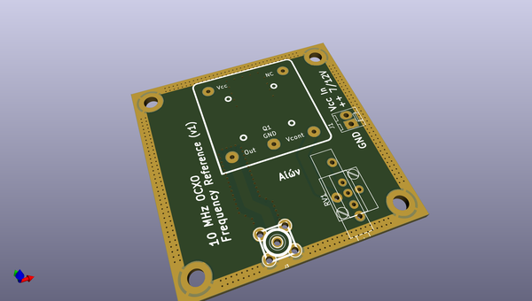
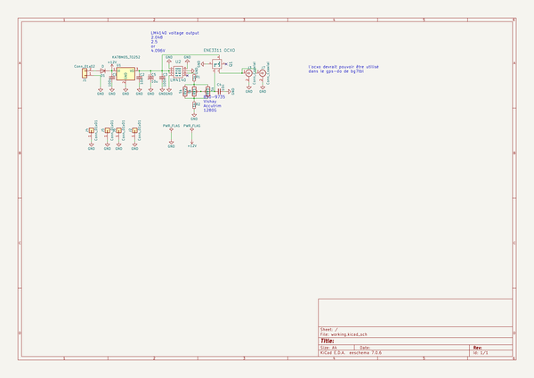

# OOMP Project  
## OCXO  by F6ITU  
  
oomp key: oomp_projects_flat_f6itu_ocxo  
(snippet of original readme)  
  
- OCXO  
Aiôn, a 10 MHz OCXO reference  
  
Aiôn is the god of the cyclic time in ancien Greece  
  
This very basic and simple OCXO 10 MHz clock could be used   
as a reference for an RF generator, a frequency meter, or  
any kind of equipment needing a precise timebase.  
  
It has been originally designed to fit the "external clock input"  
of any modern Software Defined Radio, Angelia being one of them  
  
This board has been integrated in the "Alex" pcb series  
  
  
   
  
  
  
  full source readme at [readme_src.md](readme_src.md)  
  
source repo at: [https://github.com/F6ITU/OCXO](https://github.com/F6ITU/OCXO)  
## Board  
  
  
## Schematic  
  
  
  
[schematic pdf](working_schematic.pdf)  
## Images  
