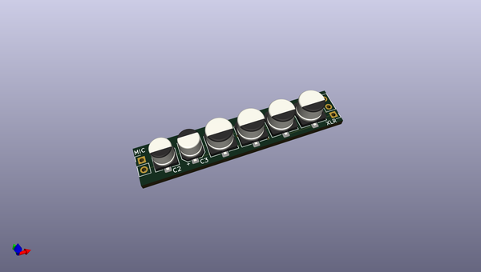
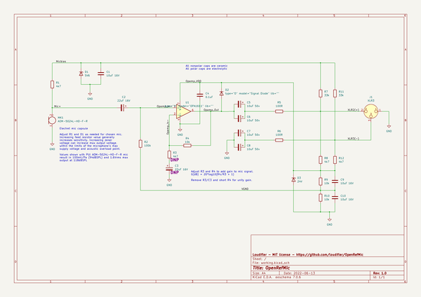
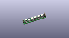
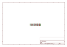
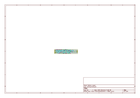
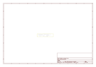
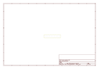
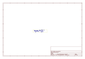
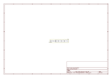

# OOMP Project  
## OpenRefMic  by F6ITU  
  
(snippet of original readme)  
  
- OpenRefMic  
OpenRefMic is an open hardware design for a reference microphone that fits in the popular 1/2" reference microphone form factor, works with consumer microphone interfaces, and meets or exceeds the performance of professional reference microphones at a vastly reduced total system cost.  
  
  
  
   
   
  
-- Critical specs, performance  
  
- Frequency Response: 10Hz-25kHz (±1dB after EQ)  
- Noise Floor: 18dBA  
- Acoustic Overload Point: 118dBSPL  
- Dimensions: 12.7x99mm  
- Parts cost: $40 (not including 3D printed parts)  
- Interface: mini-XLR, 48V phantom power  
- Total system cost: <$250 (with Focusrite Scarlett 2i2)  
  
  
  
  
  
<!--TODO: table with comparison to B&K 4191 and Dayton EMM-6-->  
  
   
   
  
-- Project Overview  
The core of the OpenRefMic design is a preamplifier that biases an electret microphone from 48V phantom power and buffers the microphone signal to send it to a standard microphone interface. The circuit was designed for the [PUI AOM-5024L-HD-F-R](https://www.puiaudio.com/media/SpecSheet/AOM-5024L-HD-F-R.pdf) low noise microphone capsule, and has been built and tested with that part, but should work with most other electret mics. The schematic and PCB layout were done with KiCAD and are available in the [Preamplifier section](preamplifier/PREAMPLIFIER.md) of the project, along with the BOM for all electrical an  
  full source readme at [readme_src.md](readme_src.md)  
  
source repo at: [https://github.com/F6ITU/OpenRefMic](https://github.com/F6ITU/OpenRefMic)  
## Board  
  
  
## Schematic  
  
  
  
[schematic pdf](working_schematic.pdf)  
## Images  
  
  
  
  
  
  
  
  
  
  
  
  
  
  
  
  
