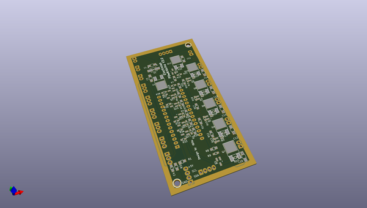
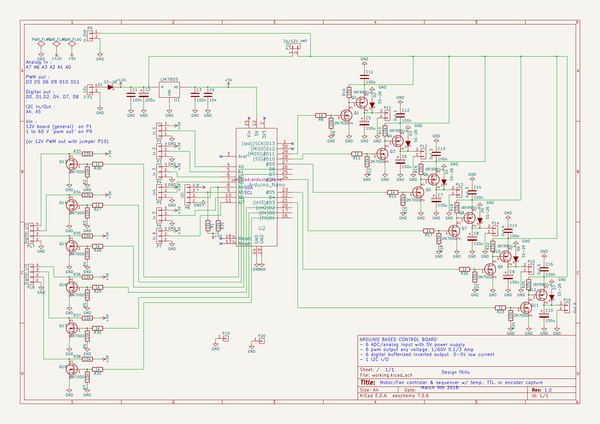

# OOMP Project  
## P0wArduino  by F6ITU  
  
(snippet of original readme)  
  
- P0wArduino  
all purpose Arduino powered control board (http://wiki.electrolab.fr/Projets:Lab:2016:Ardui_P0wa)  
  
Ce projet Kicad concerne une carte électronique "multiusage" capable de piloter des charges importantes 60V max, 2 à 3 ampères par sortie)  
que cette charge nécessite un pilotage "analogique" (tension variable de 0 à N volts par modulation pwm)   
ou des états logiques (0 volts/N volts),  
en fonctions d'entrées soit numériques (0/5V)   
soit analogiques (signal 0 à 5V numérisée par un CAN d'entrée 1024 bits)   
  
La description complète du projet est disponible sur   
http://wiki.electrolab.fr/Projets:Lab:2016:Ardui_P0wa  
le pcb du projet peut être obtenu via Dirt Cheap PCB  
http://dirtypcbs.com/view.php?share=19023&accesskey=  
  
  full source readme at [readme_src.md](readme_src.md)  
  
source repo at: [https://github.com/F6ITU/P0wArduino](https://github.com/F6ITU/P0wArduino)  
## Board  
  
  
## Schematic  
  
  
  
[schematic pdf](working_schematic.pdf)  
## Images  
