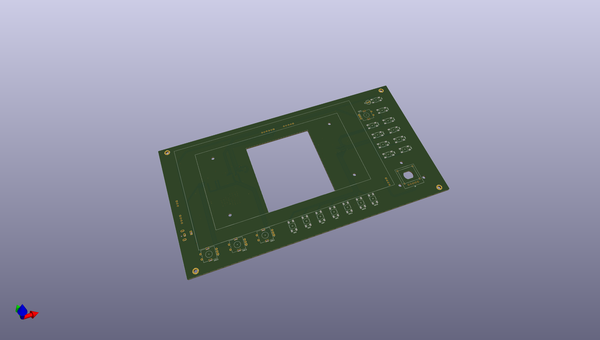

# OOMP Project  
## piHPSDR_Controller  by F6ITU  
  
(snippet of original readme)  
  
'''PiHPSDR, a embedded SDR controler for the OpenHPSDR Software Defined Radio familly'''  
  
This repository is a "pseudo fork" of a Raspberry Pi based SDR controler created by Kjell Karlsen LA2NI and Laurence Baker G8NJJ  
for the hardware project, and by John Melton G0ORX for the software part.  
  
The original software repository could be found at https://github.com/g0orx/pihpsdr   
  
The whole KiCAD design effort has been made by Matthis Schmieder, DB9MAT https://github.com/mathisschmieder. May he be thanked for the quality of his work   
   
His schematic is in fact a simplified version or G0ORX's project (https://github.com/g0orx/pihpsdr/blob/master/controller/PiHPSDR_Controller_MK_II_Rev.2_Schema.zip),   
using single axis encoders instead hard to find dual axis devices.   
  
Assembly instructions -in French language- could be found on the Electrolab's Wiki https://wiki.electrolab.fr/Projets:Lab:2020:PiHPSDR  
  
This very simple Ham Radio project is perfect for beginners who intend to beginners strengthen their experience in the SMD field.  
   
 An interactive BOM could be downloaded from the BOM directory (iBom Pihpsdr controler.html), and a complete Excel spreadsheet   
 gives the references of each component used, using mostly the Mouser catalog  
   
  full source readme at [readme_src.md](readme_src.md)  
  
source repo at: [https://github.com/F6ITU/piHPSDR_Controller](https://github.com/F6ITU/piHPSDR_Controller)  
## Board  
  
  
## Schematic  
  
  
  
[schematic pdf](working_schematic.pdf)  
## Images  
