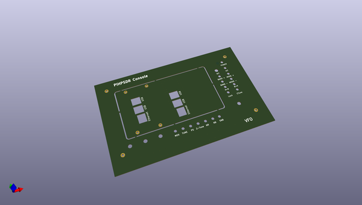

# OOMP Project  
## PiHPSDR_frontplate  by F6ITU  
  
oomp key: oomp_projects_flat_f6itu_pihpsdr_frontplate  
(snippet of original readme)  
  
- PiHPSDR_frontplate  
Frontplate for the PiHPSDR console  
  
Cette façade  a été conçue pour la console PiHPSDR dessinée par Matthis DL9MAT.   
  
Conçue sous Kicad, elle peut être confiée à une "FabHouse" spécialisée dans la production de circuits imprimés  
  
Ses dimensions sont celles d'un boitier Hammond aluminium référence 1444-1172, de 279 x 178 x 51 cm  
  
(voir https://www.mouser.fr/ProductDetail/Hammond-Manufacturing/1444-1172?qs=KZicGfxjZ20dQoymhHePwQ== )  
  
Cette façade remplace le couvercle ref 1434-117  
  
L'emplacement central de ce couvercle doit être découpé pour laisser apparaitre l'écran tactile de la console. Une fois détachée, cette plaque   
comporte deux découpes pouvant servir de flasque latérale coté ports Ethernet et USB. Selon que l'on positionne cette flasque d'un côté ou de l'autre,   
elle s'adaptera à un Raspberry Pi 3 ou 4.  
  
Les décors sont laissés à l'appréciation et au sens artistique de chacun.   
  
  
  
  
  
  
  full source readme at [readme_src.md](readme_src.md)  
  
source repo at: [https://github.com/F6ITU/PiHPSDR_frontplate](https://github.com/F6ITU/PiHPSDR_frontplate)  
## Board  
  
  
## Schematic  
  
  
  
[schematic pdf](working_schematic.pdf)  
## Images  
