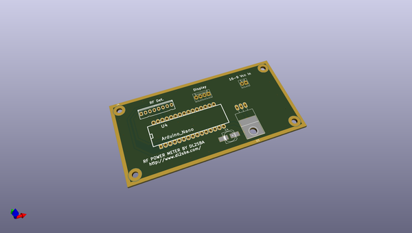
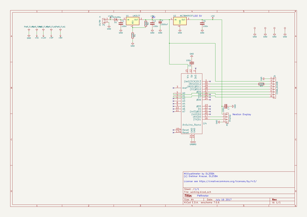

# OOMP Project  
## PWRmeter  by F6ITU  
  
(snippet of original readme)  
  
This millwattmeter project has been driven by   
  
(c) Dietmar Krause, DL2SBA  
  
License see https://creativecommons.org/licenses/by/4.0/  
  
All software update, construction and calibration hints could be found at   
  
http://www.dl2sba.com/index.php/elektronik/messtechnik/rf-powermeter  
  
This board  supports two power rails, an Arduino nano and   
3 Molex kk connectors to fit the power input, an Itead Nextion touche display, and  
an "all in one" RF detector designed by SV1AFN including :   
An AD8318 det.log, a 12 bits ADC and a low noise 5V power supply. All details at   
  
https://www.sv1afn.com/ad8318.html  
  
This is a one day project, even for unexperimented ham/hackers.   
  
Board's dimension is 5x10 cm.   
Two boards could be panelized to fit in a 10x10 standard pcb format  
(Itead, Dirt Cheap pcb, Seeed Studio etc)   
  
  
  
  full source readme at [readme_src.md](readme_src.md)  
  
source repo at: [https://github.com/F6ITU/PWRmeter](https://github.com/F6ITU/PWRmeter)  
## Board  
  
  
## Schematic  
  
  
  
[schematic pdf](working_schematic.pdf)  
## Images  
