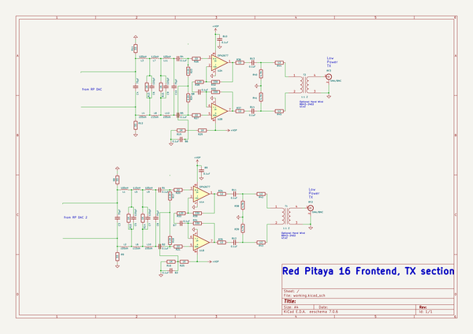

# OOMP Project  
## RP16_Frontend  by F6ITU  
  
(snippet of original readme)  
  
- RP16_Frontend  
dual RX/TX SDR frontend for the 16 bits Red Pitaya dev board  
  
  full source readme at [readme_src.md](readme_src.md)  
  
source repo at: [https://github.com/F6ITU/RP16_Frontend](https://github.com/F6ITU/RP16_Frontend)  
## Board  
  
  
## Schematic  
  
  
  
[schematic pdf](working_schematic.pdf)  
## Images  
