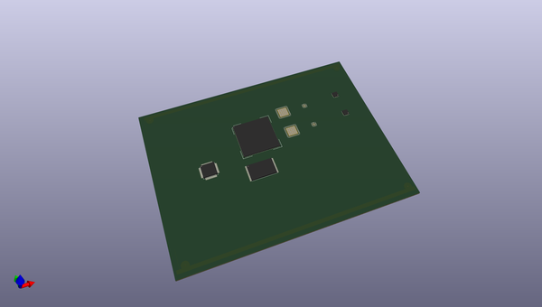

# OOMP Project  
## soderpastemask  by F6ITU  
  
oomp key: oomp_projects_flat_f6itu_soderpastemask  
(snippet of original readme)  
  
- soderpastemask  
temporary project, solderpaste mask for Angelia board reversed from silkmask gerber  
  
  full source readme at [readme_src.md](readme_src.md)  
  
source repo at: [https://github.com/F6ITU/soderpastemask](https://github.com/F6ITU/soderpastemask)  
## Board  
  
  
## Schematic  
  
  
  
[schematic pdf](working_schematic.pdf)  
## Images  
