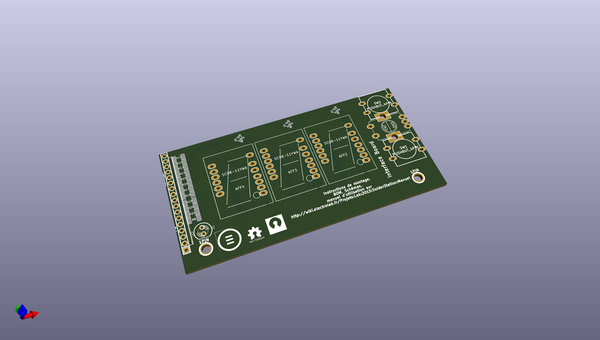
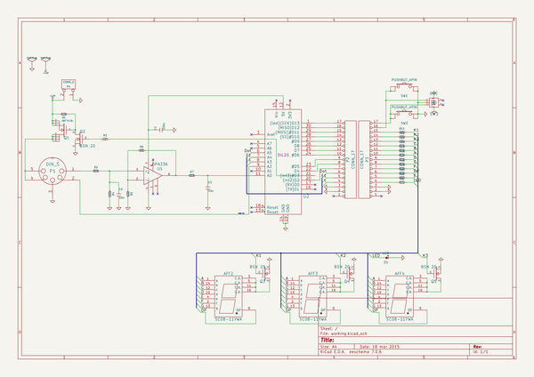

# OOMP Project  
## solderstation  by F6ITU  
  
(snippet of original readme)  
  
Kicad files for the Soldestation project,   
https://wiki.electrolab.fr/Projets:SolderStationW  
  
  full source readme at [readme_src.md](readme_src.md)  
  
source repo at: [https://github.com/F6ITU/solderstation](https://github.com/F6ITU/solderstation)  
## Board  
  
  
## Schematic  
  
  
  
[schematic pdf](working_schematic.pdf)  
## Images  
