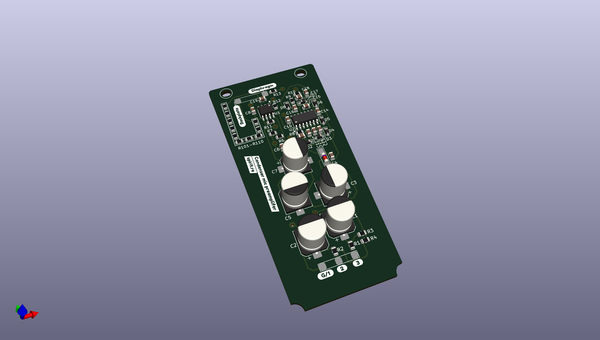
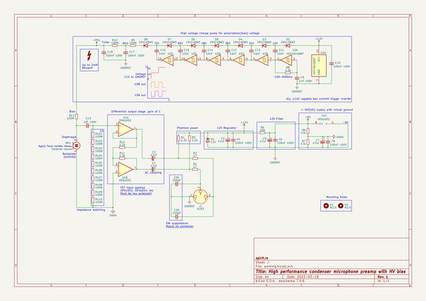
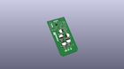
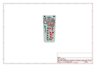
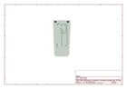
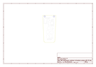
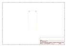
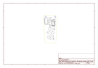

# OOMP Project  
## studio_mic  by F6ITU  
  
oomp key: oomp_projects_flat_f6itu_studio_mic  
(snippet of original readme)  
  
- Simple, high quality condenser microphone for under $100  
  
I needed a good quality microphone, but all of the options available were either a bit pricy or just not really good in performance, so I decided to build my own.  
  
The microphone build uses a clone RK12/CK12 capsule($40-50 on Aliexpress/Ebay/etc, search for "edge terminated capsule"), a U87 donor body($15-30, also Aliexpress, search term "U87 mic"), and a custom preamp board($20-30, this project).  
  
The board is very simple, yet high performance - it uses a dual FET input opamp in a single package to both convert the capsule's impedance and provide a differential signal, while the bias is provided by a slightly cursed hex schmitt trigger inverter charge pump.  
  
With the setup pictured below, the results are, to the non-audiophool ear, perfect. There is practically no self-noise due to the simplicity of the circuit and performance of the chosen opamp, plenty of dynamic range, and no signal distortion/"colortaion". You get exactly what the capsule sees on the XLR connector.  
  
---- Notes about component choice  
  1. You can use pretty much any FET input opamp, **however** you must pay close attention to the quiescent current. This circuit uses a fairly high impedance power path, and the phantom power standard can't provide much current in the first place. Total power consumption of the two opamps should be no more than ~7-8mA(3.5-4mA per).  
  
  2. Same goes for the hex inverter in terms of power consumption, but otherwise any  
  full source readme at [readme_src.md](readme_src.md)  
  
source repo at: [https://github.com/F6ITU/studio_mic](https://github.com/F6ITU/studio_mic)  
## Board  
  
  
## Schematic  
  
  
  
[schematic pdf](working_schematic.pdf)  
## Images  
  
  
  
  
  
  
  
  
  
  
  
  
  
  
  
  
