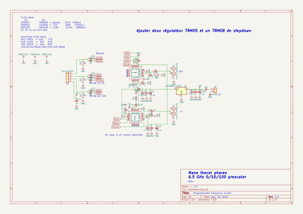

# OOMP Project  
## Thecel_phares  by F6ITU  
  
oomp key: oomp_projects_flat_f6itu_thecel_phares  
(snippet of original readme)  
  
- Thecel_phares  
A "by 1-10-100" 6.5 GHz max programmable divider/prescaler for frequency meter.   
  
Mane Thecel Phares (Counted, Weighed, Divided in ancient Hebraic) is a programable prescaler   
able to divide by 1 (no division), by 10 or by 100 any frequency under 6.5 GHz.   
  
This kind of module can transform an old 50 MHz (or less) frequency meter in a modern high-end 5 GHz class instrument for  
a minimal investment.   
  
The heart of this project is a pair of Hittite (now Analog Device) HMC705, a programmable divider by 1 to 17 specified   
at 6.5 GHz with a Ultra Low SS B Phase Noise Floor of -153 dBc/Hz @ 100 kHz.  
Each I.C. is sold around 50 USD, meaning tha with a little bit more than 100 to 150 USD, you can upgrade  
any old but still good reciprocal counter.   
  
The only difficulty is to solder a rather small QFN IC with 24 "leads" on a 4x4 mm package.   
  
Each I.C. needs a little bit less than 200 mA (400 mA for the whole design). Any 5V ldo would be able to supply the needed voltage and current.   
  
Enjoy  
  
ps : Why such a name ? because any frequency prescaler is able to wheight, count and divide -it's primary function after all-. I'ts also a reference  
of Philip K. Dick novel "A maze of death".   
  
  
  full source readme at [readme_src.md](readme_src.md)  
  
source repo at: [https://github.com/F6ITU/Thecel_phares](https://github.com/F6ITU/Thecel_phares)  
## Board  
  
  
## Schematic  
  
  
  
[schematic pdf](working_schematic.pdf)  
## Images  
