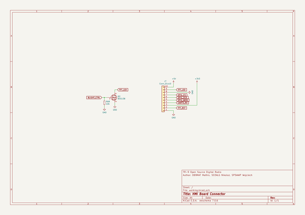
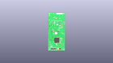
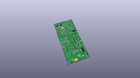
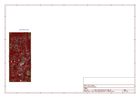
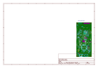
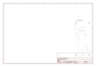
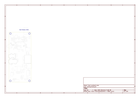
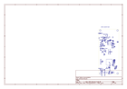
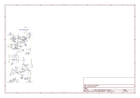

# OOMP Project  
## TR-9  by F6ITU  
  
(snippet of original readme)  
  
- TR-9  
  
  
TR-9 is a handheld transceiver (HT) for the M17 standard. Its specification can be found [here](https://github.com/sp5wwp/M17_spec).  
This repo contains KiCAD schematics and gerber files.   
  
The source code has been moved to [M17-project/TR-9_firmware](https://github.com/m17-project/TR-9_firmware).  
The codeplug example has been moved to [TR-9_Codeplug](https://github.com/M17-Project/codeplug)  
  
- Capabilities  
The TR-9 Radio will be capable of the following:  
* UHF band (420 MHz - 450 MHz)  
* Digital Voice ([M17 Codec](https://docs.m17project.org))  
* FM Voice  
* APRS via 1200 bps Packet (AX.25)  
* Short text messaging (SMS-like)  
* Optional Wi-Fi and GPS modules  
  
- Hardware    
The heart of TR-9 is STM32F777VI microcontroller. The handheld also contains:    
*  a **DEM 128128A1 TMH-PWN** 1.44" 128x128px TFT display    
*  an **ESP8266-12F** WiFi module    
*  an **ADF7021** chip for the RF    
*  an **LSM9DS1** 9DoF sensor    
*  a USB-micro connector for firmware update (so-called *DFU mode*)    
*  an SD-micro card slot for codeplug and storage    
*  a connector for a GNSS module    
*  a Kenwood connector for external MIC/SPK    
  
RF output level can be regulated by the software. The maximum power output is 3 watts. The radio can work with both analog and digital modulation.    
  
  
  
- Software  
M17 standard was designed having [Codec2](https://github.com/drowe67/codec2) vocoder in mind. TR-9 takes advantage of STM's internal   
  full source readme at [readme_src.md](readme_src.md)  
  
source repo at: [https://github.com/F6ITU/TR-9](https://github.com/F6ITU/TR-9)  
## Board  
  
  
## Schematic  
  
  
  
[schematic pdf](working_schematic.pdf)  
## Images  
  
  
  
  
  
  
  
  
  
  
  
  
  
  
  
  
