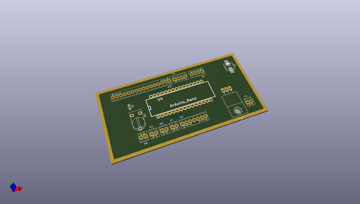
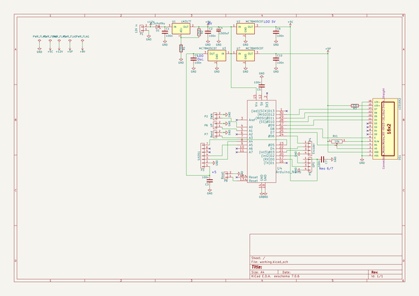

# OOMP Project  
## VFO-DO  by F6ITU  
  
oomp key: oomp_projects_flat_f6itu_vfo_do  
(snippet of original readme)  
  
VFO-DO  
RF Generator, Kicad project  
  
VFO-DO est un générateur HF couvrant de quelques kHz à 100 MHz.  
  
Il s'agit d'une idée originale de Gene Marcus W3PM/GM4YRE  
publiée dans un article de la revue QEX  
  
http://www.arrl.org/files/file/QEX_Next_Issue/2015/Jul-Aug_2015/Marcus.pdf  
  
Ce projet Kicad n'est que la transposition dudit projet.   
  
La propriété intellectuelle et les droits de publication appartiennent respectivement   
à l'auteur et à la société de publication mentionnés  
  
Ce projet offre à chaque débutant en électronique ou en radioélectricité les éléments nécessaires  
à la construction d'une source de fréquence stable (précise au Herz près, puisque pilotée par l'étalon césium  
de l'essaim de satellites GPS)... et surtout simple à construire -à assembler serait le terme le plus exact.  
  
Cette réalisation peut servir d'équipement de terrain, là ou le déplacement d'un oscillateur asservi  
-équipement fragile et coûteux- est inenvisageable. C'est surtout une approche simple pour piloter un petit SDR ou remplacer le VFO   
d'un appareil radio traditionnel  
  
Plus d'informations sur le module oscillateur à base de SiLabs Si5351   
https://learn.adafruit.com/adafruit-si5351-clock-generator-breakout?view=all  
  
une seconde source de ce module   
  
https://www.sv1afn.com/si5351a.html  
Attention : ce dernier module n'est pas "pin compatible" avec le précédent  
  
Le firmware originel de l'auteur   
http://www.knology.net/~gmarcus/Si5351/Si5351_vfo_v5.ino.zip  
  
Un émetteur-récepteur WSPR conçu par l'auteur e  
  full source readme at [readme_src.md](readme_src.md)  
  
source repo at: [https://github.com/F6ITU/VFO-DO](https://github.com/F6ITU/VFO-DO)  
## Board  
  
  
## Schematic  
  
  
  
[schematic pdf](working_schematic.pdf)  
## Images  
