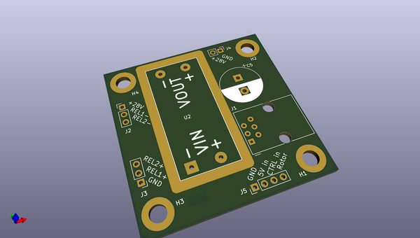
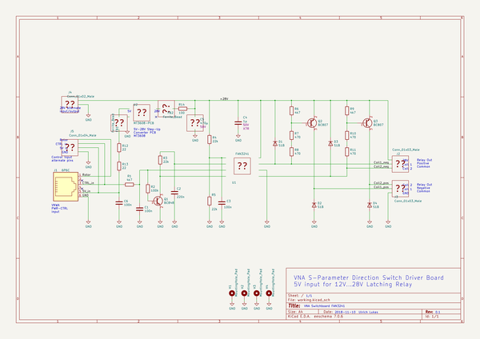

# OOMP Project  
## vna-switchboard  by F6ITU  
  
(snippet of original readme)  
  
  
  
  
  
- VNA-Switchboard FAN3241  
KiCad project files for PCB driving a 12V...28V latching relay  
from a single 5V voltage source, control is a high/low input signal.  
  
Using an MT3608 step-up DCDC converter input current-limited  
to less than 100 mA, timing and protection circuitry integrated  
into FAN3241 driver IC and RF/EMC shielding provision for the  
step-up coverter, this is designed for driving the direction  
switch of a VNA S-parameter test set.  
  
The input is a 6P6 western socket pinning compatible to the  
DG8SAQ VNWA3. When this input is connected, no additional power  
supply or control signals are required.  
  
Schematic PDF: [VNA-Switchboard_FAN3241.pdf](VNA-Switchboard_FAN3241.pdf)  
  
  full source readme at [readme_src.md](readme_src.md)  
  
source repo at: [https://github.com/F6ITU/vna-switchboard](https://github.com/F6ITU/vna-switchboard)  
## Board  
  
  
## Schematic  
  
  
  
[schematic pdf](working_schematic.pdf)  
## Images  
