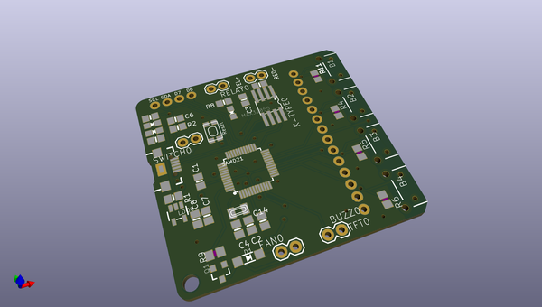
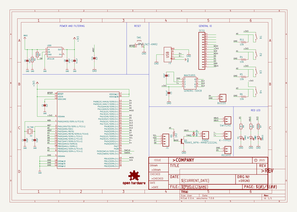

# OOMP Project  
## ReflowMaster  by farizno  
  
(snippet of original readme)  
  
- ReflowMaster  
  
Reflow Master is my open source toaster oven reflow controller that I also sell full assembled on tindie:  
https://www.tindie.com/products/13378/  
  
  
  
It's custom hardware and custom code but all open source so if you want the challenge of making one yourself or you want to hack the code, go for it!  
  
I have a live stream build of the board here if you want to see what's involved  
https://www.youtube.com/watch?v=OGQ-GZZ90oE  
  
  
- ReflowMaster Design Files  
  
Inlcluded in this reposity:  
- EagleCAD schematics and Board layout files (Eagle 9.1)   
- Exported Gerber files (Gerber 274X)  
- STL files for the 3D printed case  
- Adrduino code  
  
- Open Source License  
The hardware design files are released as open source under the CERN license. Please review the license before using these files in your own projects to understand your obligations.  
  
- STL files for 3D printing  
I have included the STL files for the case and also the exhaust fan adapter I made for my specific toaster oven.   
  
**NOTE:** Do not print the exhauist fan in PLA, please use PETG or ABS as PLA warps/melts at a low temp. Also DO NOT connect the 3D printed exhaust fan directly to the metal of teh oven, it will melt and ruin your oven. You will need to add some heat resistant insulator between the metal and the 3D print.   
  
- Which TFT?  
The TFT I am using is a 2.4" SPI TFT using the ILI9341 Driver available via...  
  
AliExpress  
http://s.clic  
  full source readme at [readme_src.md](readme_src.md)  
  
source repo at: [https://github.com/farizno/ReflowMaster](https://github.com/farizno/ReflowMaster)  
## Board  
  
  
## Schematic  
  
  
  
[schematic pdf](working_schematic.pdf)  
## Images  
