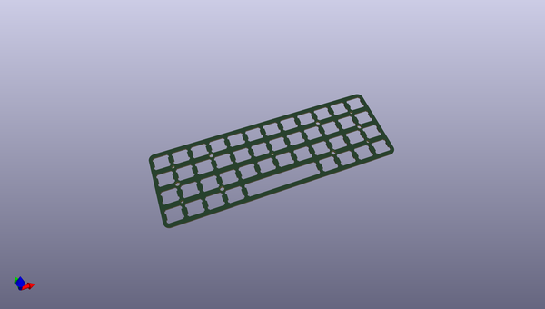
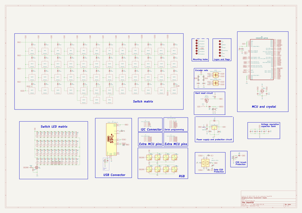

# OOMP Project  
## SharkPCB  by FateNozomi  
  
(snippet of original readme)  
  
- Acheron Aχξρων 40-SM-O-MX-TH-WI (Codename "SharkPCB")  
  

  
     

  
  
See [this page](https://gondolindrim.github.io/AcheronDocs/shark/shark.html) for the SharkPCB documentation.  
  
  full source readme at [readme_src.md](readme_src.md)  
  
source repo at: [https://github.com/FateNozomi/SharkPCB](https://github.com/FateNozomi/SharkPCB)  
## Board  
  
  
## Schematic  
  
  
  
[schematic pdf](working_schematic.pdf)  
## Images  
