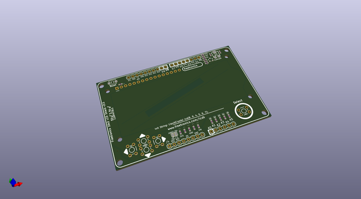
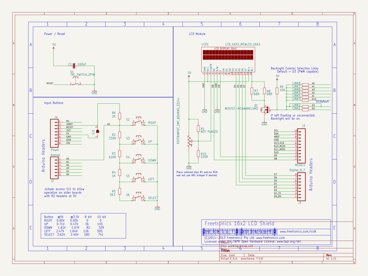

# OOMP Project  
## 16x2LCDShieldv2  by freetronics  
  
oomp key: oomp_projects_flat_freetronics_16x2lcdshieldv2  
(snippet of original readme)  
  
Freetronics 16x2 LCD Shield  
===========================  
Copyright 2011 Freetronics Pty Ltd    
Freetronics site:  <www.freetronics.com>    
Freetronics email: <info@freetronics.com>    
  
A compact shield to connect an HD44780-compatible, 16x2 LCD module  
and interface buttons to an Arduino or compatible such as a  
Freetronics Eleven.  
  
Features:  
  
 * Reset button connected to Arduino reset pin.  
 * 100nF smoothing capacitor.  
 * Buttons for "up", "down", "left", "right", and "select" all on a  
   single analog input pin.  
 * Parts overlay on both the top and the bottom.  
  
More information is available at:  
  
  http://www.freetronics.com/16x2lcd  
  
The "docs" folder within this repository includes a handy copy of the  
schematic in PDF format and image(s) of the pcb.  
  
  
INSTALLATION  
------------  
The design is saved as an EAGLE project. EAGLE PCB design software is  
available from www.cadsoftusa.com free for non-commercial use. To use  
this project download it and place the directory containing these files  
into the "eagle" directory on your computer. Then open EAGLE and  
navigate to Projects -> eagle -> 16x2LCDShieldv2.  
  
  
DISTRIBUTION  
------------  
The specific terms of distribution of this project are governed by the  
license referenced below.  
  
  
LICENSE  
-------  
Licensed under the TAPR Open Hardware License (www.tapr.org/OHL).  
The "license" folder within this repository also contains a copy of  
this license in plain text format.  
  
  full source readme at [readme_src.md](readme_src.md)  
  
source repo at: [https://github.com/freetronics/16x2LCDShieldv2](https://github.com/freetronics/16x2LCDShieldv2)  
## Board  
  
  
## Schematic  
  
  
  
[schematic pdf](working_schematic.pdf)  
## Images  
