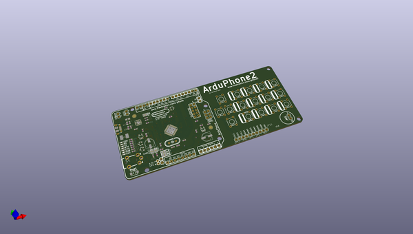
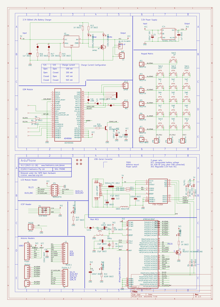

# OOMP Project  
## ArduPhone  by freetronics  
  
(snippet of original readme)  
  
Freetronics ArduPhone  
=====================  
Copyright 2013 Freetronics Pty Ltd www.freetronics.com    
  
The ArduPhone is an Arduino compatible board with onboard  
GSM module, OLED display, matrix keypad, and battery  
charger.  
  
Features:  
  
 * Micro-USB connector for charging and programming  
 * Overlay guide where you need it (both top and bottom)  
 * Mounting holes and power pads  
  
More info at:  
  
  http://www.freetronics.com.au/phone  
  
  
INSTALLATION  
------------  
The design is saved as an EAGLE project. EAGLE PCB design software is  
available from www.cadsoftusa.com free for non-commercial use. To use  
this project download it and place the directory containing these files  
into the "eagle" directory on your computer. Then open EAGLE and  
navigate to Projects -> eagle -> PHONE.  
  
  
DISTRIBUTION  
------------  
The specific terms of distribution of this project are governed by the  
license referenced below.  
  
  
LICENSE  
-------  
Licensed under the TAPR Open Hardware License (www.tapr.org/OHL).  
The "license" folder within this repository also contains a copy of  
this license in plain text format.  
  
  
CREDITS  
-------  
The ArduPhone was designed by Jonathan Oxer (jon@freetronics.com)  
inspired by previous work by David Mellis.  
  
  full source readme at [readme_src.md](readme_src.md)  
  
source repo at: [https://github.com/freetronics/ArduPhone](https://github.com/freetronics/ArduPhone)  
## Board  
  
  
## Schematic  
  
  
  
[schematic pdf](working_schematic.pdf)  
## Images  
