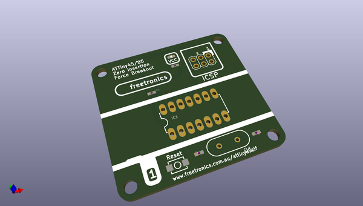
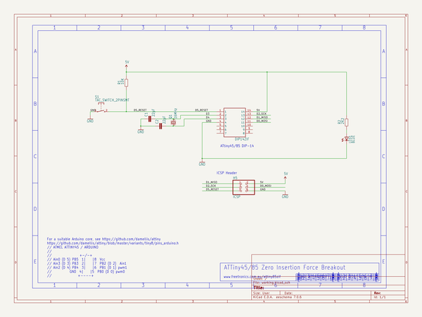

# OOMP Project  
## ATTINY85ZIF  by freetronics  
  
oomp key: oomp_projects_flat_freetronics_attiny85zif  
(snippet of original readme)  
  
Freetronics ATtiny85 AVR ZIF Breakout  
===================================  
Copyright 2017 Freetronics Pty Ltd    
Freetronics site:  www.freetronics.com    
Freetronics email: info@freetronics.com    
  
Breakout for a ZIF (Zero Insertion Force) socket for ATtiny85 AVR microcontrollers,  
with a header for ICSP.  
  
Features:  
  
 * 14-pin ZIF socket (use only part of the socket)  
 * Header for 6-pin ICSP cable  
 * Power LED  
 * Reset button  
  
More information is available at:  
  
  http://www.freetronics.com/attiny85zif  
  
  
INSTALLATION  
------------  
The design is saved as an EAGLE project. EAGLE PCB design software is  
available from www.cadsoftusa.com free for non-commercial use. To use  
this project download it and place the directory containing these files  
into the "eagle" directory on your computer.  
  
  
DISTRIBUTION  
------------  
The specific terms of distribution of this project are governed by the  
license referenced below.  
  
  
LICENSE  
-------  
Licensed under the TAPR Open Hardware License (www.tapr.org/OHL).  
The "license" folder within this repository also contains a copy of  
this license in plain text format.  
  
  full source readme at [readme_src.md](readme_src.md)  
  
source repo at: [https://github.com/freetronics/ATTINY85ZIF](https://github.com/freetronics/ATTINY85ZIF)  
## Board  
  
  
## Schematic  
  
  
  
[schematic pdf](working_schematic.pdf)  
## Images  
