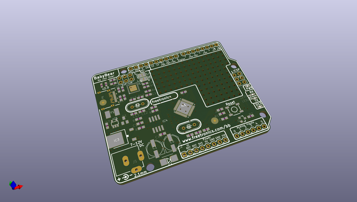
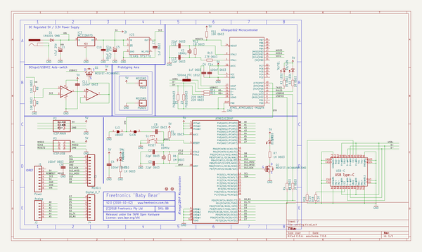

# OOMP Project  
## BABYBEAR  by freetronics  
  
(snippet of original readme)  
  
Freetronics Baby Bear  
=====================  
Copyright 2013-2018 Freetronics Pty Ltd  <www.freetronics.com>    
  
The Baby Bear is an Arduino Compatible Board based on the ATmega1284P  
MCU, which means it's compatible with projects designed for the Arduino  
Uno but has more memory and I/O capabilities.  
  
Features:  
  
 * USB-C connector  
 * Prototyping area  
 * LEDs visible on the edge when a shield is fitted  
 * Overlay guide where you need it (both top and bottom)  
 * D13 pin works for everything  
 * Mounting holes and power pads  
 * All connections in the same place  
  
You can find more information at:  
  
  http://www.freetronics.com.au/babybear  
  
  
INSTALLATION  
------------  
The design is saved as an EAGLE project. EAGLE PCB design software is  
available from www.cadsoftusa.com free for non-commercial use. To use  
this project download it and place the directory containing these files  
into the "eagle" directory on your computer. Then open EAGLE and  
navigate to the project.  
  
  
INSTALLATION  
------------  
The design is saved as an EAGLE project. EAGLE PCB design software is  
available from www.cadsoftusa.com free for non-commercial use. To use  
this project download it and place the directory containing these files  
into the "eagle" directory on your computer.  
  
  
DISTRIBUTION  
------------  
The specific terms of distribution of this project are governed by the  
license referenced below.  
  
  
LICENSE  
-------  
Licensed under the TAPR Open Hardware License (www.tapr.org/OHL).  
The "license" folder within this reposi  
  full source readme at [readme_src.md](readme_src.md)  
  
source repo at: [https://github.com/freetronics/BABYBEAR](https://github.com/freetronics/BABYBEAR)  
## Board  
  
  
## Schematic  
  
  
  
[schematic pdf](working_schematic.pdf)  
## Images  
