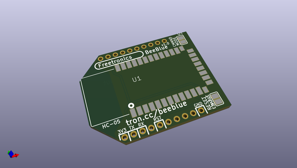
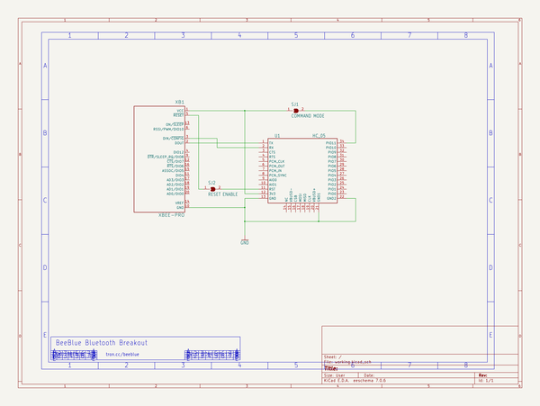

# OOMP Project  
## BeeBlue  by freetronics  
  
oomp key: oomp_projects_flat_freetronics_beeblue  
(snippet of original readme)  
  
Freetronics Bluetooth Module for XBee  
=====================================  
Copyright 2014 Freetronics Pty Ltd <http://www.freetronics.com.au>    
  
A Bluetooth module with an XBee footprint, so that it can be inserted  
into boards designed to use XBee modules and give them Bluetooth  
capability instead.  
  
More information is available at:  
  
  http://www.freetronics.com.au/beeblue  
  
  
INSTALLATION  
------------  
The design is saved as an EAGLE project. EAGLE PCB design software is  
available from www.cadsoftusa.com free for non-commercial use. To use  
this project download it and place the directory containing these files  
into the "eagle" directory on your computer. Then open EAGLE and  
navigate to the project.  
  
  
DISTRIBUTION  
------------  
The specific terms of distribution of this project are governed by the  
license referenced below.  
  
  
LICENSE  
-------  
Licensed under the TAPR Open Hardware License (www.tapr.org/OHL).  
The "license" folder within this repository also contains a copy of  
this license in plain text format.  
  
  full source readme at [readme_src.md](readme_src.md)  
  
source repo at: [https://github.com/freetronics/BeeBlue](https://github.com/freetronics/BeeBlue)  
## Board  
  
  
## Schematic  
  
  
  
[schematic pdf](working_schematic.pdf)  
## Images  
