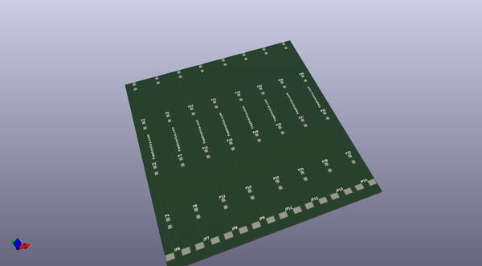
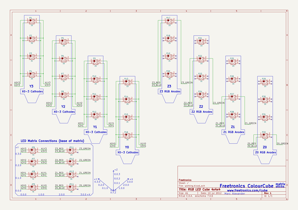

# OOMP Project  
## Cube4-hardware  by freetronics  
  
oomp key: oomp_projects_flat_freetronics_cube4_hardware  
(snippet of original readme)  
  
Freetronics Cube  
===========================  
Copyright 2010-2013 Freetronics Pty Ltd    
Freetronics site:  www.freetronics.com    
Freetronics email: info@freetronics.com    
  
The Cube is a USB powered, smart RGB LED Cube kit, with a serial command  
interface for direct control and learning, an open source driver library  
and an on-board Arduino compatible MCU running the whole show!  
  
The Cube was designed using the open source KiCad schematic and pcb  
design package: http://www.kicad-pcb.org  
  
The schematic pages have been carefully laid out to make it easy to follow and  
learn about a larger microcontroller based project design in operation.  
  
Features:  
  
 * Power and control by USB commands straight from your computer (Windows, Mac or Linux)  
 * Expansion port connector for sensors, joysticks, game and interface add ons  
 * Onboard ATmega32u4 MCU (Arduino Leonardo compatible)  
 * USB interface for uploading new sketches and sending serial commands  
 * Arduino driver library with example programs and animations at:  
   https://github.com/freetronics/Cube4  
 * Includes ZigBee/XBee headers so you can add a wireless module (not included)  
 * Prototyping area with I2C, power and spare pins next to it  
  
More information is available on our product page at:  
  
  http://www.freetronics.com/cube  
  
This project is made up of 3 schematic and pcb project folders.  
Each folder within this repository includes a handy copy of the  
schematic in PDF format and image(s) of the main pcb.  
  
  
INSTALLATION  
------------  
  
  full source readme at [readme_src.md](readme_src.md)  
  
source repo at: [https://github.com/freetronics/Cube4-hardware](https://github.com/freetronics/Cube4-hardware)  
## Board  
  
  
## Schematic  
  
  
  
[schematic pdf](working_schematic.pdf)  
## Images  
