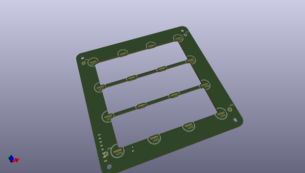
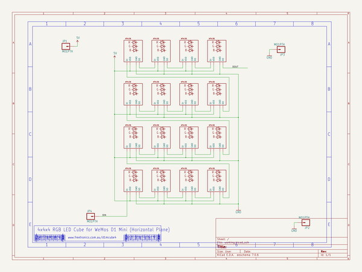

# OOMP Project  
## D1MCUBE4  by freetronics  
  
oomp key: oomp_projects_flat_freetronics_d1mcube4  
(snippet of original readme)  
  
4x4x4 RGB LED Cube for the WeMos D1 Mini  
=========================================  
  
Copyright 2017 Freetronics Pty Ltd  www.freetronics.com.au    
  
4x4x4 RGB LED cube that can be controlled by a [WeMos D1 Mini][1], a  
microcontroller board based on the ESP8266 module.  
  
Features:  
  
 * 64 x 8mm addressable RGB LEDs (APA106)  
 * 2.1mm DC jack and solder terminal connections for power input.  
  
More information is available at:  
  
  http://www.freetronics.com.au/d1mcube4  
  
  
INSTALLATION  
------------  
The design is saved as an EAGLE project. EAGLE PCB design software is  
available from www.cadsoftusa.com free for non-commercial use. To use  
this project download it and place the directory containing these files  
into the "eagle" directory on your computer, then navigate to the  
project.  
  
  
DISTRIBUTION  
------------  
The specific terms of distribution of this project are governed by the  
license referenced below.  
  
  
LICENSE  
-------  
Licensed under the TAPR Open Hardware License (www.tapr.org/OHL).  
The "license" folder within this repository also contains a copy of  
this license in plain text format.  
  
  
[1]: http://www.wemos.cc/wiki/doku.php?id=en:d1_mini  
  
  
  full source readme at [readme_src.md](readme_src.md)  
  
source repo at: [https://github.com/freetronics/D1MCUBE4](https://github.com/freetronics/D1MCUBE4)  
## Board  
  
  
## Schematic  
  
  
  
[schematic pdf](working_schematic.pdf)  
## Images  
