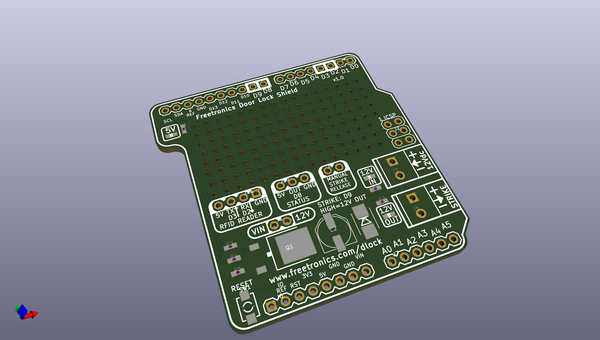

# OOMP Project  
## DLOCK  by freetronics  
  
oomp key: oomp_projects_flat_freetronics_dlock  
(snippet of original readme)  
  
Freetronics RFID Door Lock Shield  
==================================  
Copyright 2013 Freetronics Pty Ltd    
Freetronics site:  www.freetronics.com    
Freetronics email: info@freetronics.com    
  
Based on the circuit described in the "RFID Access Control" project in  
the book "Practical Arduino", this shield allows you to control a door  
lock using an electric strike plate using a number of commonly  
available RFID reader modules.  
  
Supported reader modules include:  
  
 * ID12  
 * ID20  
 * RDM630  
 * RDM880  
 * HF MultiTag  
  
Features:  
  
 * Reset button wired through to Arduino reset pin.  
 * Blue "Arduino power on" LED with current-limiting resistor.  
 * 100nF bypass/smoothing capacitor on supply rails.  
 * Overlay guide where you need it: both top and bottom.  
  
Compatible with the Freetronics TwentyTen, Arduino Uno, Arduino  
Duemilanove, and other compatible boards based on the same header  
format.  
  
More information is available at:  
  
  http://www.freetronics.com/dlock  
  http://www.practicalarduino.com/projects/rfid-access-control  
  
  
INSTALLATION  
------------  
The design is saved as an EAGLE project. EAGLE PCB design software is  
available from www.cadsoftusa.com free for non-commercial use. To use  
this project download it and place the directory containing these files  
into the "eagle" directory on your computer. Then open EAGLE and  
navigate to Projects -> eagle -> DLOCK.  
  
  
DISTRIBUTION  
------------  
The specific terms of distribution of this project are governed by the  
license referenced below.  
  
  
LICEN  
  full source readme at [readme_src.md](readme_src.md)  
  
source repo at: [https://github.com/freetronics/DLOCK](https://github.com/freetronics/DLOCK)  
## Board  
  
  
## Schematic  
  
  
  
[schematic pdf](working_schematic.pdf)  
## Images  
