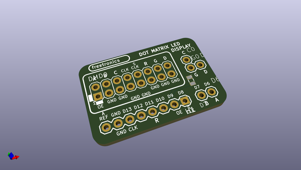
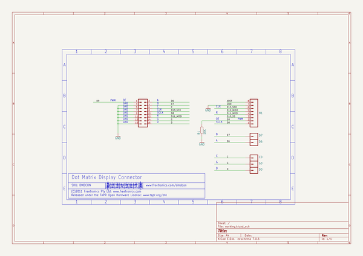

# OOMP Project  
## DMDCon  by freetronics  
  
(snippet of original readme)  
  
Freetronics DMDCon  
==============================  
Copyright 2011-2014 Freetronics Pty Ltd  
Freetronics site:  http://www.freetronics.com/  
  
An adapter board to connect an Arduino (or compatible) board to a  
Freetronics Dot Matrix Display 32x16 pixel LED matrix.  
  
DMD displays:  
http://www.freetronics.com/collections/display/dmd  
  
  
INSTALLATION  
------------  
The design is saved as an EAGLE project. EAGLE PCB design software is  
available from www.cadsoftusa.com free for non-commercial use. To use  
this project download it and place the directory containing these files  
into the "eagle" directory on your computer. Then open EAGLE and  
navigate to Projects -> eagle -> ProtoShieldShort.  
  
  
DISTRIBUTION  
------------  
The specific terms of distribution of this project are governed by the  
license referenced below.  
  
  
LICENSE  
-------  
Licensed under the TAPR Open Hardware License (http://www.tapr.org/OHL).  
The LICENSE file within this repository contains a copy of  
this license in plain text format.  
  
  full source readme at [readme_src.md](readme_src.md)  
  
source repo at: [https://github.com/freetronics/DMDCon](https://github.com/freetronics/DMDCon)  
## Board  
  
  
## Schematic  
  
  
  
[schematic pdf](working_schematic.pdf)  
## Images  
