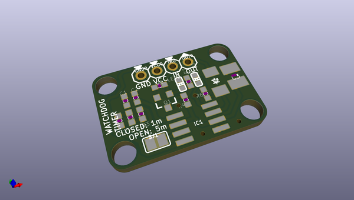
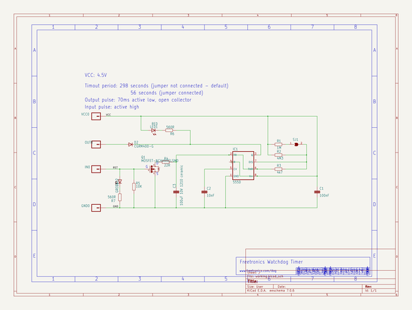

# OOMP Project  
## DOG  by freetronics  
  
(snippet of original readme)  
  
DOG  
===  
http://www.freetronics.com/products/watchdog-timer-module  
  
Design files for Freetronics watchdog timer module.  
  
Connects to your Arduino or other microcontroller project and makes sure it keeps running by watching for a “heartbeat” signal. If the signal stops, the watchdog uses the microcontroller reset line to kick it back into life.  
  
  
  full source readme at [readme_src.md](readme_src.md)  
  
source repo at: [https://github.com/freetronics/DOG](https://github.com/freetronics/DOG)  
## Board  
  
  
## Schematic  
  
  
  
[schematic pdf](working_schematic.pdf)  
## Images  
