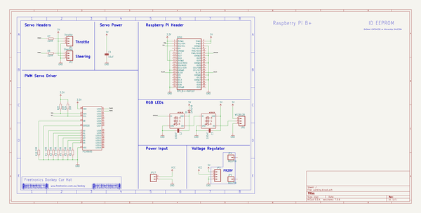

# OOMP Project  
## DONKEY  by freetronics  
  
(snippet of original readme)  
  
Donkey Car Hat for Raspberry Pi  
===============================  
  
Copyright 2018 Freetronics Pty Ltd    
www.freetronics.com.au   
  
Minimal Raspberry Pi hat to build a Donkey Car self driving car using  
a remote control car chassis.  
  
Features:  
  
 * 2 PWM output channels for steering and throttle.  
 * I2C interface with pull-up resistors.  
 * PCA9685 PWM controller IC.  
 * 2 addressable RGB LEDs.  
  
More information is available at:  
  
  http://www.freetronics.com.au/donkey  
  
  
INSTALLATION  
------------  
The design is saved as an EAGLE project. EAGLE PCB design software is  
available from www.cadsoftusa.com free for non-commercial use. To use  
this project download it and place the directory containing these files  
into the "eagle" directory on your computer.  
  
  
DISTRIBUTION  
------------  
The specific terms of distribution of this project are governed by the  
license referenced below.  
  
  
LICENSE  
-------  
Licensed under the TAPR Open Hardware License (www.tapr.org/OHL).  
The "license" folder within this repository also contains a copy of  
this license in plain text format.  
  
  full source readme at [readme_src.md](readme_src.md)  
  
source repo at: [https://github.com/freetronics/DONKEY](https://github.com/freetronics/DONKEY)  
## Board  
  
  
## Schematic  
  
  
  
[schematic pdf](working_schematic.pdf)  
## Images  
