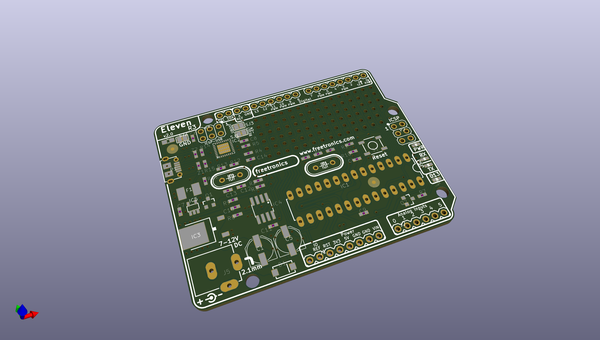
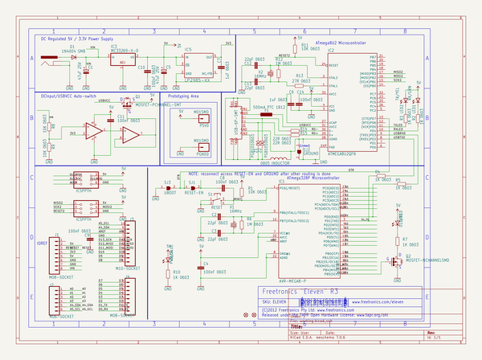

# OOMP Project  
## Eleven  by freetronics  
  
oomp key: oomp_projects_flat_freetronics_eleven  
(snippet of original readme)  
  
Freetronics Eleven R3  
=============================  
Copyright 2010-2012 Freetronics Pty Ltd    
Freetronics site:  www.freetronics.com    
Freetronics email: info@freetronics.com    
  
The Eleven is a 100% Arduino Compatible Board, based on the Arduino  
Uno reference design, but with improvements and updates for ease of  
use, cost and getting started.  
  
Features:  
  
 * Prototyping area  
 * LEDs visible on the edge  
 * Mini-USB Connector  
 * Overlay guide where you need it (both top and bottom)  
 * D13 pin works for everything  
 * Mounting holes and power pads  
 * All connections in the same place  
  
You can view more at our product page at:  
  
  http://www.freetronics.com/eleven  
  
  
INSTALLATION  
------------  
The design is saved as an EAGLE project. EAGLE PCB design software is  
available from www.cadsoftusa.com free for non-commercial use. To use  
this project download it and place the directory containing these files  
into the "eagle" directory on your computer. Then open EAGLE and  
navigate to Projects -> eagle -> Eleven.  
  
  
DISTRIBUTION  
------------  
The specific terms of distribution of this project are governed by the  
license referenced below.  
  
  
LICENSE  
-------  
This work is licensed under the  
Creative Commons Attribution-Share Alike License.    
To view a copy of this license, visit  
  
  http://creativecommons.org/licenses/by-sa/3.0/    
  http://creativecommons.org/licenses/by-sa/3.0/legalcode  
  
or send a letter to  
  
  Creative Commons    
  171 Second Street, Suite 300    
  San Francisco    
  California, 94105  
  full source readme at [readme_src.md](readme_src.md)  
  
source repo at: [https://github.com/freetronics/Eleven](https://github.com/freetronics/Eleven)  
## Board  
  
  
## Schematic  
  
  
  
[schematic pdf](working_schematic.pdf)  
## Images  
