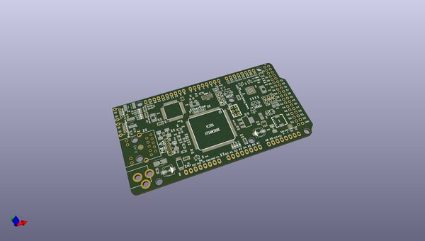
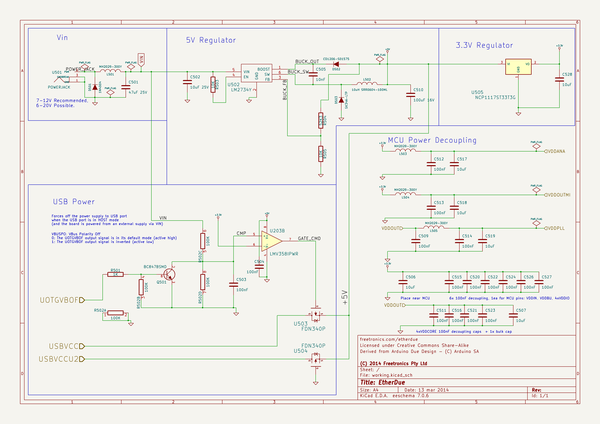

# OOMP Project  
## EtherDue  by freetronics  
  
oomp key: oomp_projects_flat_freetronics_etherdue  
(snippet of original readme)  
  
- EtherDue  
  
The EtherDue is an 100% Arduino Due compatible board with onboard Ethernet.  
  
For full details about the EtherDue, including a getting started guide, please visit the [Freetronics EtherDue product page](http://www.freetronics.com/products/etherdue-arduino-due-compatible-with-onboard-ethernet).  
  
Design files were produced with [Kicad](http://kicad-pcb.org). A [PDF of the schematic is available](https://github.com/freetronics/EtherDue/raw/master/EtherDue.pdf).  
  
  
  full source readme at [readme_src.md](readme_src.md)  
  
source repo at: [https://github.com/freetronics/EtherDue](https://github.com/freetronics/EtherDue)  
## Board  
  
  
## Schematic  
  
  
  
[schematic pdf](working_schematic.pdf)  
## Images  
