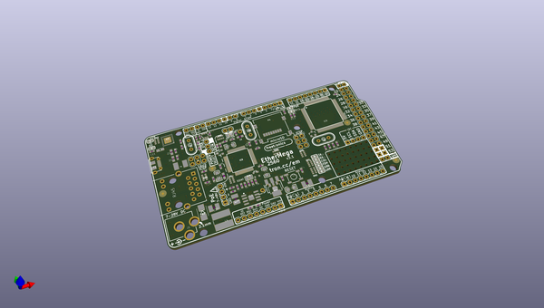
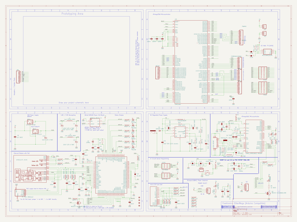

# OOMP Project  
## EtherMegaR3  by freetronics  
  
(snippet of original readme)  
  
Freetronics EtherMega R3  
========================  
Copyright 2011-2012 Freetronics Pty Ltd    
Freetronics site:  www.freetronics.com    
Freetronics email: info@freetronics.com    
  
The EtherMega R3 is a 100% Arduino-compatible board based on the existing  
Mega2560, but with improvements and updates for features and ease of  
use. It also includes on-board Ethernet with PoE (Power-over-Ethernet)  
support.  
  
Features:  
  
 * High-efficiency switchmode power supply (input voltage 7-28Vdc)  
 * Micro-USB Connector  
 * microSD card slot  
 * 10/100 Ethernet using the Wiznet W5100 chip  
 * Overlay guide where you need it (both top and bottom)  
 * D13 pin works for everything  
  
You can view more at our product page at:  
  
  http://www.freetronics.com/ethermega  
  
  
INSTALLATION  
------------  
The design is saved as an EAGLE project. EAGLE PCB design software is  
available from www.cadsoftusa.com free for non-commercial use. To use  
this project download it and place the directory containing these files  
into the "eagle" directory on your computer. Then open EAGLE and  
navigate to Projects -> eagle -> EtherMegaR3.  
  
  
DISTRIBUTION  
------------  
The specific terms of distribution of this project are governed by the  
license referenced below.  
  
  
LICENSE  
-------  
This work is licensed under the  
Creative Commons Attribution-Share Alike License.    
To view a copy of this license, visit  
  
  http://creativecommons.org/licenses/by-sa/3.0/    
  http://creativecommons.org/licenses/by-sa/3.0/legalcode  
  
or send a letter to  
  
  Creative   
  full source readme at [readme_src.md](readme_src.md)  
  
source repo at: [https://github.com/freetronics/EtherMegaR3](https://github.com/freetronics/EtherMegaR3)  
## Board  
  
  
## Schematic  
  
  
  
[schematic pdf](working_schematic.pdf)  
## Images  
