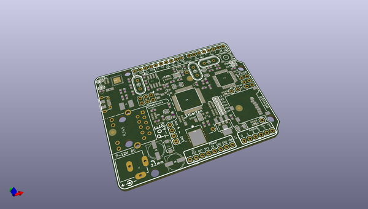
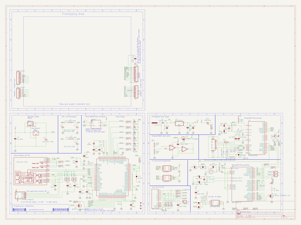

# OOMP Project  
## EtherTen  by freetronics  
  
oomp key: oomp_projects_flat_freetronics_etherten  
(snippet of original readme)  
  
Freetronics EtherTen  
====================  
Copyright 2010-2013 Freetronics Pty Ltd    
Freetronics site:  www.freetronics.com    
Freetronics email: info@freetronics.com    
  
The EtherTen is a 100% Arduino Compatible Board, based on the Arduino  
Uno reference design, but with improvements and updates for ease of use, cost  
and getting started. It also includes on-board Ethernet with PoE (Power  
-over-Ethernet) support.  
  
Features:  
  
 * LEDs visible on the edge  
 * Micro-USB Connector  
 * I2C MAC address ROM  
 * Overlay guide where you need it (both top and bottom)  
 * D13 pin works for everything  
 * RX pin biased  
 * Mounting holes, power and X3 pads  
 * All connections in the same place  
  
You can view more at our product page at:  
  
  http://www.freetronics.com/etherten  
  
This repository includes a handy copy of the schematic in PDF format.  
  
  
INSTALLATION  
------------  
The design is saved as an EAGLE project. EAGLE PCB design software is  
available from www.cadsoftusa.com free for non-commercial use. To use  
this project download it and place the directory containing these files  
into the "eagle" directory on your computer. Then open EAGLE and  
navigate to Projects -> eagle -> EtherTen.  
  
  
DISTRIBUTION  
------------  
The specific terms of distribution of this project are governed by the  
license referenced below.  
  
  
LICENSE  
-------  
This work is licensed under the  
Creative Commons Attribution-Share Alike License.    
To view a copy of this license, visit  
  
  http://creativecommons.org/licenses/by-sa/3.0/    
  h  
  full source readme at [readme_src.md](readme_src.md)  
  
source repo at: [https://github.com/freetronics/EtherTen](https://github.com/freetronics/EtherTen)  
## Board  
  
  
## Schematic  
  
  
  
[schematic pdf](working_schematic.pdf)  
## Images  
