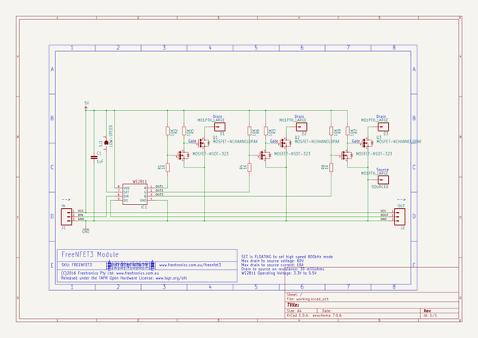

# OOMP Project  
## FREENFET3  by freetronics  
  
oomp key: oomp_projects_flat_freetronics_freenfet3  
(snippet of original readme)  
  
Freetronics FreeNFET Addressable 3x N-MOSFET Module  
====================================================  
Copyright 2016 Freetronics Pty Ltd    
Freetronics site:  www.freetronics.com    
Freetronics email: info@freetronics.com    
  
These are FETs with a brain! Includes 3 x NTD5867NL N-channel MOSFETs and  
a WS2811 addressable LED driver. That means you can connect the module  
and address it just as if it was a NeoPixel or other WS28xx RGB LED,   
except that instead of controlling an LED, you're controlling 3 high-power  
MOSFETs.  
  
This smart module can be daisy-chained, so you can connect a number of  
these together in a string and drive each of them individually from your  
microcontroller.  
  
Compatible with various Arduino libraries for the WS2811, including  
the FastLED library and the NeoPixel library. Simply control the "red",  
"green", and "blue" channels to control the FETs.  
  
Features:  
  
 * Switch up to 60V / 18A DC per FET.  
 * Requires just 1 data connection.  
 * PWM control of the FETs.  
 * Input and output headers on opposite sides of the board for easy  
   daisy-chaining.  
  
More information is available at:  
  
  http://www.freetronics.com.au/freenfet3  
  
  
INSTALLATION  
------------  
The design is saved as an EAGLE project. EAGLE PCB design software is  
available from www.cadsoftusa.com free for non-commercial use. To use  
this project download it and place the directory containing these files  
into the "eagle" directory on your computer.  
  
  
DISTRIBUTION  
------------  
The specific terms of distribu  
  full source readme at [readme_src.md](readme_src.md)  
  
source repo at: [https://github.com/freetronics/FREENFET3](https://github.com/freetronics/FREENFET3)  
## Board  
  
  
## Schematic  
  
  
  
[schematic pdf](working_schematic.pdf)  
## Images  
