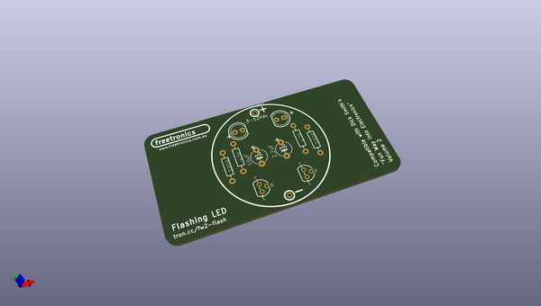
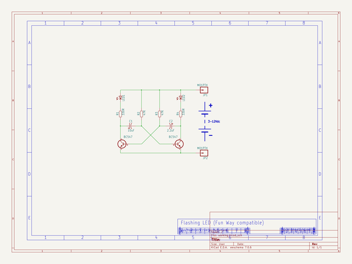

# OOMP Project  
## FW2-01-FlashingLED  by freetronics  
  
oomp key: oomp_projects_flat_freetronics_fw2_01_flashingled  
(snippet of original readme)  
  
Flashing LED  
============  
Copyright 2016 Freetronics Pty Ltd    
Freetronics site:  http://www.freetronics.com.au    
Freetronics email: <info@freetronics.com>    
  
Based on the project "Multi Purpose Flashing LED" described in the book  
"Funway Into Electronics Volume 2" by Dick Smith.  
  
Flashes an LED. Optionally flashes 2 LEDs alternating.  
  
More information is available at:  
  
  http://www.freetronics.com.au/fw2-flash    
  
  
INSTALLATION  
------------  
The design is saved as an EAGLE project. EAGLE PCB design software is  
available from www.cadsoftusa.com free for non-commercial use. To use  
this project download it and place the directory containing these files  
into the "eagle" directory on your computer.  
  
  
DISTRIBUTION  
------------  
The specific terms of distribution of this project are governed by the  
license referenced below.  
  
  
LICENSE  
-------  
Licensed under the TAPR Open Hardware License (www.tapr.org/OHL).  
The "license" folder within this repository also contains a copy of  
this license in plain text format.  
  
  full source readme at [readme_src.md](readme_src.md)  
  
source repo at: [https://github.com/freetronics/FW2-01-FlashingLED](https://github.com/freetronics/FW2-01-FlashingLED)  
## Board  
  
  
## Schematic  
  
  
  
[schematic pdf](working_schematic.pdf)  
## Images  
