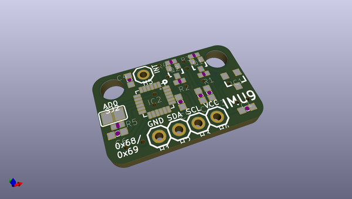
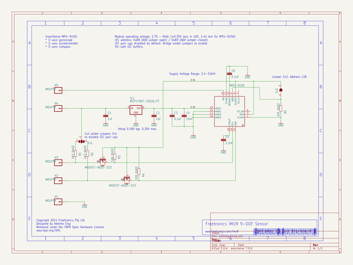

# OOMP Project  
## IMU9  by freetronics  
  
(snippet of original readme)  
  
IMU9  
====  
http://www.freetronics.com/products/9-dof-imu-accelerometer-gyroscope-magnetometer  
  
Design files for the Freetronics IMU9 - a 9-DOF IMU with I2C interface.  
  
Combining an accelerometer, a magnetometer, and a gyroscope all in one tiny package with an Arduino-friendly I2C interface.  
  
Perfect for building an autopilot for a quadcopter, or tracking the position of a robot, or logging data in a rocket. Combine three axis data from each of the sensors for a total of 9 degrees-of-freedom (DOF) of tracking.  
  
  full source readme at [readme_src.md](readme_src.md)  
  
source repo at: [https://github.com/freetronics/IMU9](https://github.com/freetronics/IMU9)  
## Board  
  
  
## Schematic  
  
  
  
[schematic pdf](working_schematic.pdf)  
## Images  
