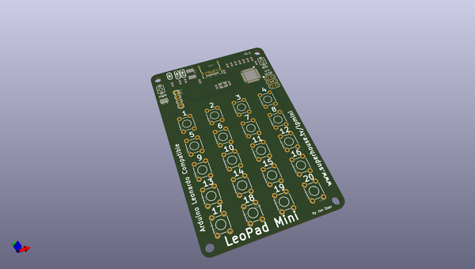
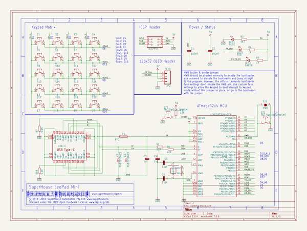

# OOMP Project  
## LEOPADMINI  by freetronics  
  
oomp key: oomp_projects_flat_freetronics_leopadmini  
(snippet of original readme)  
  
Freetronics LeoPad Mini  
========================  
Copyright 2018 Freetronics Pty Ltd  www.freetronics.com    
  
A USB keypad with an ATMega32u4 controller, compatible with the Arduino  
Leonardo.  
  
Features:  
  
 * ATmega 32u4 MCU  
 * 20-key keypad (4x5 matrix)  
 * HWB (hardware boot) button and solder jumper to allow disabling bootloader  
 * 128x32 OLED module  
 * USB-C connector  
  
You can view more details at:  
  
  http://www.freetronics.com.au/leopadmini  
  
  
INSTALLATION  
------------  
The design is saved as an EAGLE project. EAGLE PCB design software is  
available from www.cadsoftusa.com free for non-commercial use. To use  
this project download it and place the directory containing these files  
into the "eagle" directory on your computer. Then open EAGLE and  
navigate to the project.  
  
  
CREDITS  
-------  
Jonathan Oxer jon@freetronics.com  
  
  
DISTRIBUTION  
------------  
The specific terms of distribution of this project are governed by the  
license referenced below.  
  
  
LICENSE  
-------  
Licensed under the TAPR Open Hardware License (www.tapr.org/OHL).  
The "license" folder within this repository also contains a copy of  
this license in plain text format.  
  
  full source readme at [readme_src.md](readme_src.md)  
  
source repo at: [https://github.com/freetronics/LEOPADMINI](https://github.com/freetronics/LEOPADMINI)  
## Board  
  
  
## Schematic  
  
  
  
[schematic pdf](working_schematic.pdf)  
## Images  
