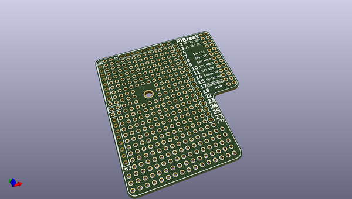
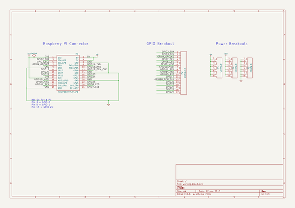

# OOMP Project  
## PiBreak  by freetronics  
  
oomp key: oomp_projects_flat_freetronics_pibreak  
(snippet of original readme)  
  
PiBreak is a prototyping board for Raspberry Pi.  
  
  
  
It provides labelled breakout pins for all GPIOs, a large prototyping area with solder pads, and power rails for easy power connection.  
  
PiBreak is Copyright (C) 2013 Freetronics Pty Ltd. Released under the TAPR Open Hardware License as described in the file LICENSE.  
  
Raspberry Pi is a registered trademark of the Raspberry Pi Foundation.  
  
  full source readme at [readme_src.md](readme_src.md)  
  
source repo at: [https://github.com/freetronics/PiBreak](https://github.com/freetronics/PiBreak)  
## Board  
  
  
## Schematic  
  
  
  
[schematic pdf](working_schematic.pdf)  
## Images  
