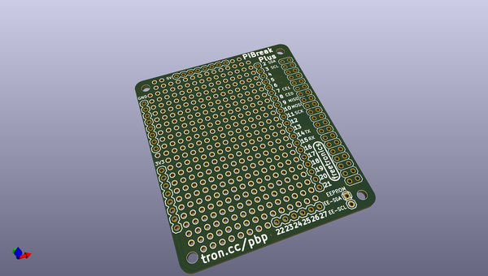
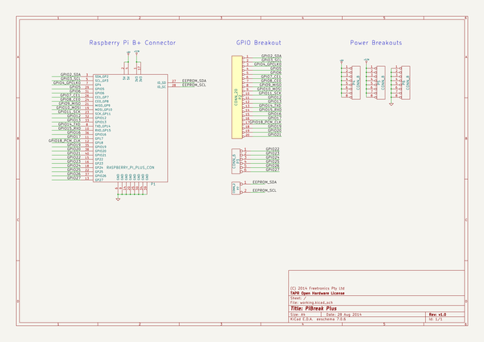

# OOMP Project  
## PiBreakPlus  by freetronics  
  
(snippet of original readme)  
  
PiBreak Plus is a prototyping board for Raspberry Pi Model B+.  
  
It is the sibling of [PiBreak](https://github.com/freetronics/PiBreak), a prototyping board for Raspberry Pi Model A & Model B.  
  
  
  
It provides labelled breakout pins for all GPIOs, a large prototyping area with solder pads, and power rails for easy power connection.  
  
PiBreakPlus is Copyright (C) 2014 Freetronics Pty Ltd. Released under the TAPR Open Hardware License as described in the file LICENSE.  
  
Raspberry Pi is a registered trademark of the Raspberry Pi Foundation.  
  
  full source readme at [readme_src.md](readme_src.md)  
  
source repo at: [https://github.com/freetronics/PiBreakPlus](https://github.com/freetronics/PiBreakPlus)  
## Board  
  
  
## Schematic  
  
  
  
[schematic pdf](working_schematic.pdf)  
## Images  
