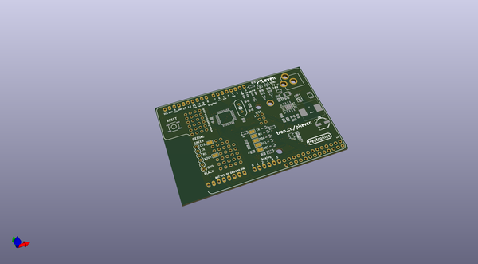
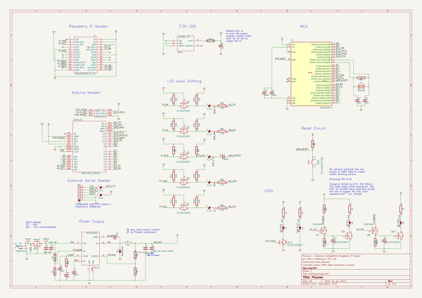

# OOMP Project  
## PiLeven  by freetronics  
  
(snippet of original readme)  
  
PiLeven  
=======  
  
PiLeven is an Arduino Uno compatible board (Freetronics Eleven based) that plugs straight into a Raspberry Pi.  
  
For more information about PiLeven, see the [PiLeven home page](http://www.freetronics.com/pileven).  
  
Documentation  
=============  
  
For steps to set up PiLeven, see the [PiLeven Getting Started Guide](http://freetronics.com/pages/pileven-getting-started-guide).  
  
For more advanced documentation and custom configuration, check the [PiLeven Wiki](https://github.com/freetronics/PiLeven/wiki).  
  
  full source readme at [readme_src.md](readme_src.md)  
  
source repo at: [https://github.com/freetronics/PiLeven](https://github.com/freetronics/PiLeven)  
## Board  
  
  
## Schematic  
  
  
  
[schematic pdf](working_schematic.pdf)  
## Images  
