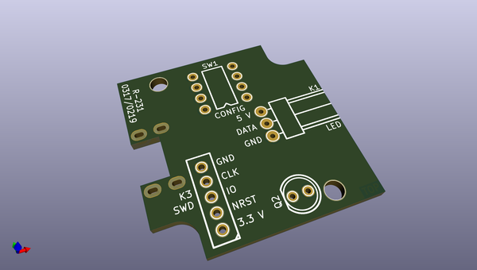
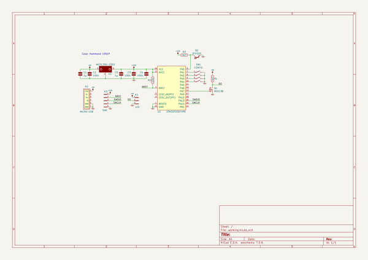

# OOMP Project  
## arachnouphobia  by fruchti  
  
(snippet of original readme)  
  
- Arachnouphobia  
  
This is a small WS2812B strip controller based on a STM32F030F4P6 whose only job it is to deliver random light flashes. This is surprisingly effective to deter spiders! More information can be found [here](https://25120.org/post/arachnouphobia/).  
  
  
  full source readme at [readme_src.md](readme_src.md)  
  
source repo at: [https://github.com/fruchti/arachnouphobia](https://github.com/fruchti/arachnouphobia)  
## Board  
  
  
## Schematic  
  
  
  
[schematic pdf](working_schematic.pdf)  
## Images  
