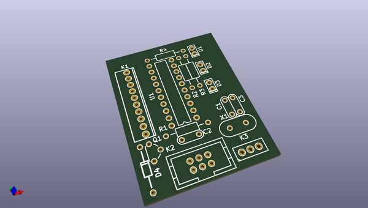
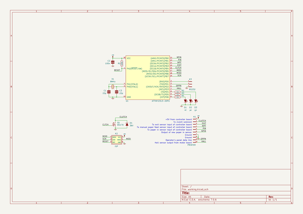

# OOMP Project  
## haxmark  by fruchti  
  
oomp key: oomp_projects_flat_fruchti_haxmark  
(snippet of original readme)  
  
- haxmark  
  
This project has the goal of modifying a Lexmark E360d/E360dn for direct PCB printing.  
  
It is based on [this](http://www.instructables.com/id/Modification-of-the-Lexmark-E260-for-Direct-Laser--1) great instructable by mlerman, which uses a Lexmark E260d. The E360d is nearly identical in its hardware. Anyhow, I found out that there are some software differences between E260d and E360d. This is why a designed a new MCU board for simulating the printer's timings.  
  
-- Project status and performance  
  
The printer behaves reasonably predictable and the way it should. The results are quite good: A minimal trace width of 5 mil and a minimal clearance of 10 mil are no big deal.  
  
  
  
A review of the project and some potential issues of the process in general can be found in [a blog post of mine](https://25120.org/post/haxmark/).  
  
-- Modification  
  
--- Some notes before you modify your printer  
  
I strongly recommend that you test your printer in an unmodified state with exactly the driver and printer settings you intend to use it with to print on PCBs. I found out the hard way that the behaviour and the timing differ from driver to driver. It is definitely a good idea to make a dump of the interesting signals (operator panel line, manual paper feed sensor, paper in sensor, exit sensor) with a logic analyser to get the exact timing of your printing setup so you can adjust the timing settings in th  
  full source readme at [readme_src.md](readme_src.md)  
  
source repo at: [https://github.com/fruchti/haxmark](https://github.com/fruchti/haxmark)  
## Board  
  
  
## Schematic  
  
  
  
[schematic pdf](working_schematic.pdf)  
## Images  
