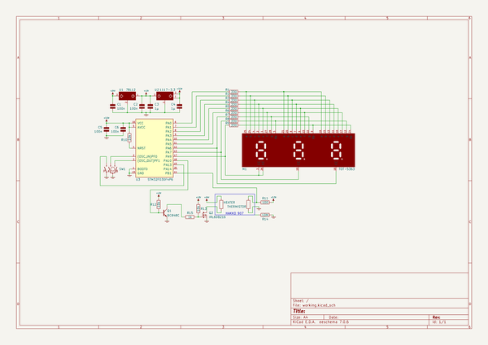

# OOMP Project  
## leshy  by fruchti  
  
oomp key: oomp_projects_flat_fruchti_leshy  
(snippet of original readme)  
  
- leshy  
  
  
[](./schematic.pdf)  
  
This is a small breakout board for the STM32F030F4P6 microcontroller,  
containing:  
  
 - An LDO, alternatively a 1117-3.3 or a MCP1700-3302 (or compatible)  
 - 6 LEDs, one as a power LED, the other 5 controllable by the controller  
 - Two pushbuttons, one pre-connected to reset  
 - A micro-SD slot with a MOSFET for turning its power off  
 - A large prototyping area designed to make both SMT and THT prototyping as  
   convenient as possible  
  
A blog post about the reasoning behind the project and about its development  
process can be found [here](https://25120.org/post/leshy/).  
  
-- Demo projects  
  
The subfolder `demo` contains some example code snippets for a quick start. Each  
contains the necessary makefile for building and flashing, so no IDE has to be  
installed in order to get started. However, the makefile is currently only  
tested on linux.  
  
  
--- Flashing and debugging  
  
The makefile currently supports two methods of flashing the controller: Either  
[texane's st-link](https://github.com/texane/stlink) or OpenOCD can be used.  
OpenOCD also allows debugging, so if the makefile detects a running OpenOCD  
instance, it will automatically upload the firmware via OpenOCD. If there's  
none running, it will fall back to `st-flash`.  
  
Each project directory includes a OpenOCD script, so you just have to start  
OpenOCD like:  
  
```  
$ openocd -f flash.cfg  
```  
  
As a matter of debugging, only text messages via sem  
  full source readme at [readme_src.md](readme_src.md)  
  
source repo at: [https://github.com/fruchti/leshy](https://github.com/fruchti/leshy)  
## Board  
  
[](working_3d.png)  
## Schematic  
  
[](working_schematic.png)  
  
[schematic pdf](working_schematic.pdf)  
## Images  
