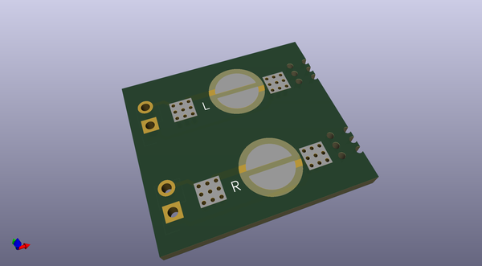
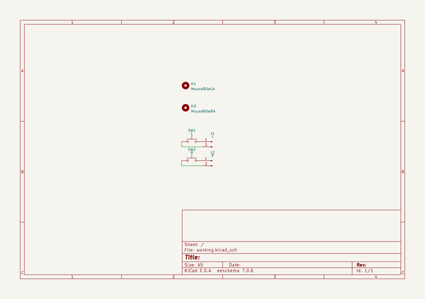

# OOMP Project  
## PhobGCC-HW  by fudge01010  
  
(snippet of original readme)  
  
- PhobGCC-HW  
Seperate repository for the hardware used in the PhobGCC  
  
  full source readme at [readme_src.md](readme_src.md)  
  
source repo at: [https://github.com/fudge01010/PhobGCC-HW](https://github.com/fudge01010/PhobGCC-HW)  
## Board  
  
  
## Schematic  
  
  
  
[schematic pdf](working_schematic.pdf)  
## Images  
