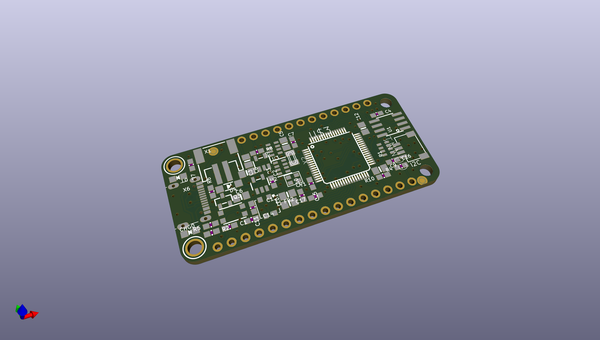
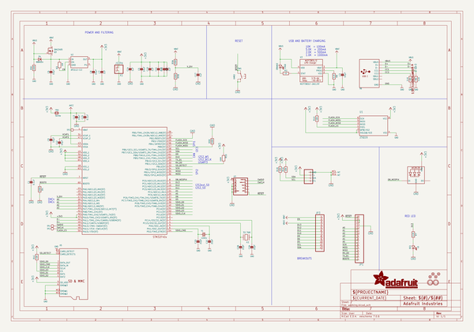

# OOMP Project  
## Adafruit-Feather-STM32F405-Express-PCB  by Gigahawk  
  
oomp key: oomp_projects_flat_gigahawk_adafruit_feather_stm32f405_express_pcb  
(snippet of original readme)  
  
-- Adafruit Adafruit Feather STM32F405 Express PCB  
  
<a href="http://www.adafruit.com/products/4382">   
Click here to purchase one from the Adafruit shop</a>  
  
PCB files for the Adafruit Adafruit Feather STM32F405 Express.   
  
Format is EagleCAD schematic and board layout  
* https://www.adafruit.com/product/4382  
  
--- Description  
  
ST takes flight in this upcoming Feather board. The new STM32F405 Feather (video) that we designed runs CircuitPython at a blistering 168MHz – our fastest CircuitPython board ever! We put a STEMMA QT / Qwiic port on the end, so you can really easily plug and play I2C sensors.  
  
This Feather has lots of goodies:  
  
* STM32F405 Cortex M4 with FPU and 1MB Flash, 168MHz speed  
* 192KB RAM total - 128 KB RAM for general usage + 64 KB program-only/cache RAM  
* 3.3V logic, but almost all pins are 5V compliant!  
* USB C power and data - our first USB C Feather!  
* LiPo connector and charger  
* SD socket on the bottom, connected to SDIO port  
* 2 MB SPI Flash chip  
* Built in NeoPixel indicator  
* I2C, UART, GPIO, ADCs, DACs  
* Qwiic/STEMMA-QT connector for fast I2C connectivity  
* We use the built-in USB DFU bootloader to load firmware. It does not come with a UF2 bootloader.  
  
With CircuitPython basics running on this board, it's fast to get all our drivers working, then use the built in plotter in Mu to instantly get sensor data displaying within 3 minutes of unboxing.  
  
You can use MicroPython, CircuitPython or Arduino IDE  
  full source readme at [readme_src.md](readme_src.md)  
  
source repo at: [https://github.com/Gigahawk/Adafruit-Feather-STM32F405-Express-PCB](https://github.com/Gigahawk/Adafruit-Feather-STM32F405-Express-PCB)  
## Board  
  
  
## Schematic  
  
  
  
[schematic pdf](working_schematic.pdf)  
## Images  
  
  
  
  
  
  
  
  
  
  
  
  
  
  
  
  
