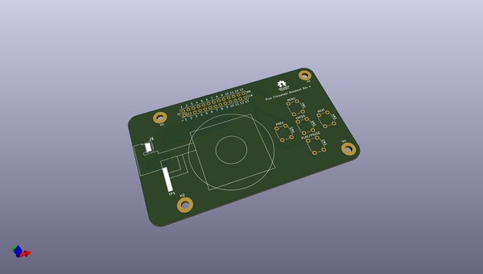
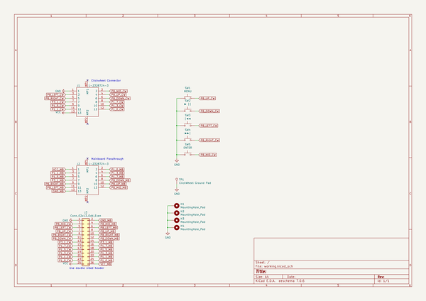

# OOMP Project  
## clickwheel_breakout_5th_gen  by Gigahawk  
  
oomp key: oomp_projects_flat_gigahawk_clickwheel_breakout_5th_gen  
(snippet of original readme)  
  
- iPod Clickwheel Breakout  
Breakout board for an iPod 5th Gen (Video) clickwheel  
  
  
  full source readme at [readme_src.md](readme_src.md)  
  
source repo at: [https://github.com/Gigahawk/clickwheel_breakout_5th_gen](https://github.com/Gigahawk/clickwheel_breakout_5th_gen)  
## Board  
  
  
## Schematic  
  
  
  
[schematic pdf](working_schematic.pdf)  
## Images  
