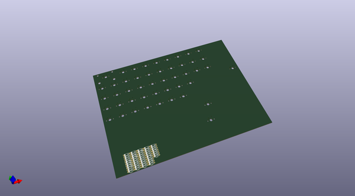
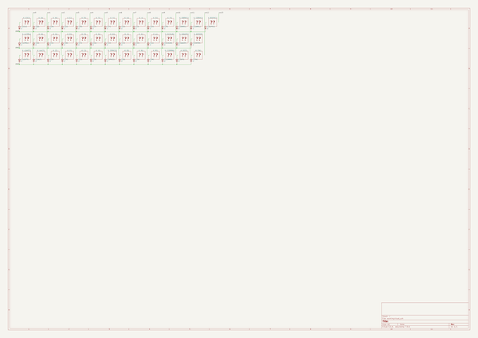

# OOMP Project  
## kbpcb  by Gigahawk  
  
(snippet of original readme)  
  
- MrKeebs PCB Generator   
  
The live instance of [MrKeebs PCB Generator ](http://kbpcb.mrkeebs.com) has been disabled for quite a while, and the replacement provided doesn't work and seems to be unmaintained.  
  
This repo reverts the deprecation message so that it can still be run locally.  
  
The output generated is still rather rough and not really directly usable, so I recommend looking at [kbpcb_postprocessor](https://github.com/Gigahawk/kbpcb_postprocessor) if you actually intend to use this in a real project.  
  
-- Dependencies  
- node  
- npm  
  
Run `npm install` to install dependencies.  
  
-- Usage  
To start the project locally run `node index.js` and navigate to `http://localhost:3000/` in a web browser.  
  
  full source readme at [readme_src.md](readme_src.md)  
  
source repo at: [https://github.com/Gigahawk/kbpcb](https://github.com/Gigahawk/kbpcb)  
## Board  
  
  
## Schematic  
  
  
  
[schematic pdf](working_schematic.pdf)  
## Images  
