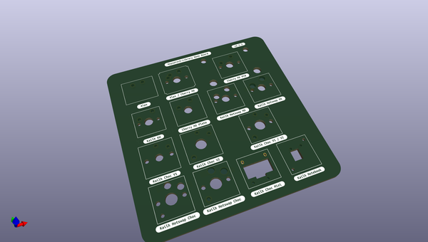

# OOMP Project  
## keyswitch-kicad-library  by Gigahawk  
  
oomp key: oomp_projects_flat_gigahawk_keyswitch_kicad_library  
(snippet of original readme)  
  
- Keyswitch Kicad Library  
  
  
  
This is a footprint library for [KiCad](https://www.kicad.org), a Cross Platform and Open Source EDA.  
  
It has footprints for most popular keyboard switches.  
  
  
  
```  
Warning!  
  
Versions prior to v2.1.2 have incorrect dimensions for Kailh choc V1 switches (as well as wrong name as it's actually V1 and V2 compatible), so please use the latest version if you want to use these. see issue -26.  
```  
  
-- Supported footprints  
  
|                                                                 |  
|-----------------------------------------------------------------|  
| Cherry MX and equivalent, Plate and PCB mount.                  |  
| Alps/Matias or equivalent.                                      |  
| Hybrid footprints for Cherry MX and Alps/Matias (accepts both). |  
| Kailh Choc low profile switches V1 (CPG1350).                   |  
| Kailh Choc low profile switches V2 (CPG1353).                   |  
| Kailh Hotswap sockets for Cherry MX equivalent switches.        |  
| Kailh Hotswap sockets for Choc low profile switches             |  
| Kailh KH CPG1280                                                |  
| Kailh CPG1425                                                   |  
| Kailh Choc Mini CPG1232                                         |  
  
If you find any issues, missing footprints or want another family of switches supported please [open an issue](https://git  
  full source readme at [readme_src.md](readme_src.md)  
  
source repo at: [https://github.com/Gigahawk/keyswitch-kicad-library](https://github.com/Gigahawk/keyswitch-kicad-library)  
## Board  
  
[](working_3d.png)  
## Schematic  
  
[](working_schematic.png)  
  
[schematic pdf](working_schematic.pdf)  
## Images  
