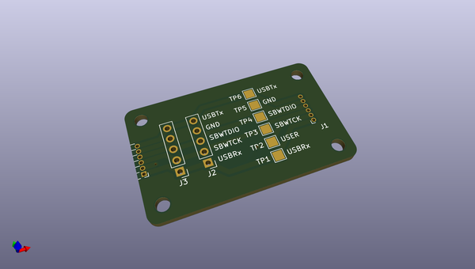
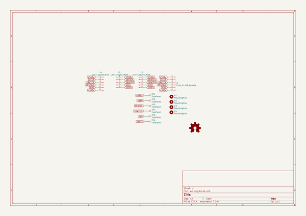

# OOMP Project  
## mech423_final_project  by Gigahawk  
  
(snippet of original readme)  
  
- LitePog  
  
LitePog is a clone of the [Light Pong](https://www.playlightpong.com/) game.  
  
  
  
-- Folder Structure  
- `firmware`: Code Composer Studio workspace containing firmware for the MSP430FR5739  
- `mech`: SolidWorks mechanical CAD files  
- `pcb`: KiCad electrical CAD files  
- `wiring`: WireViz wire harness diagrams and diagrams.net system wiring diagram  
- `proposal`: Initial project proposal for MECH 423 written in LaTeX  
- `report`: Final project report for MECH 423 written in LaTeX  
- `images`: Images for this readme  
  
  full source readme at [readme_src.md](readme_src.md)  
  
source repo at: [https://github.com/Gigahawk/mech423_final_project](https://github.com/Gigahawk/mech423_final_project)  
## Board  
  
  
## Schematic  
  
  
  
[schematic pdf](working_schematic.pdf)  
## Images  
