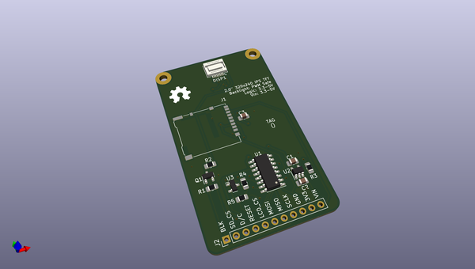
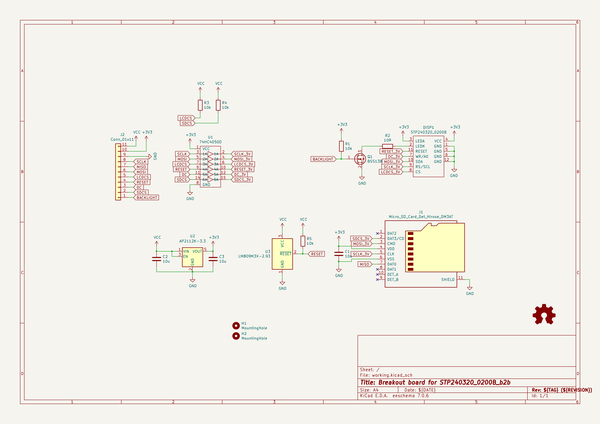
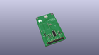
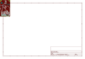
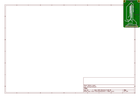
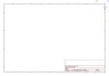
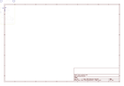
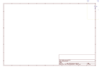
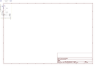

# OOMP Project  
## STP240320_0200B_b2b  by Gigahawk  
  
(snippet of original readme)  
  
- STP240320_0200B_b2b  
  
A PCB that adapts the ribbon connector of the STP240320_0200B_b2b to a [Molex SlimStack 55560-0168](https://www.molex.com/molex/products/part-detail/pcb_headers/0555600168)  
> The footprint used is the KiCad native [55560-0161](https://gitlab.com/kicad/libraries/kicad-footprints/-/blob/master/Connector_Molex.pretty/Molex_SlimStack_55560-0161_2x08_P0.50mm_Vertical.kicad_mod), there doesn't seem to be an appreciable difference.  
  
  
  
  
-- Background  
  
The STP240320_0200B is a 2.0" 240x320 ST7789 based TFT display.  
It is used in many 2.0" ST7789 display modules, some examples:  
- [Adafruit 2.0" 320x240 Color IPS TFT Display with microSD Card Breakout](https://www.adafruit.com/product/4311)  
- [Waveshare 240×320, General 2inch IPS LCD Display Module](https://www.waveshare.com/2inch-lcd-module.htm)  
  
The display itself can be purchased from [Surenoo Display on AliExpress](https://www.aliexpress.com/item/4000469644849.html), if you find other vendors please feel free to open an issue or PR.  
  
  
The flex ribbon connector isn't designed to go into a FFC connector, so this board is used to connectorize the display.  
  
--- Update 2022-10-27  
I have recently purchased more of these displays and they are not the same as the displays I originally purchased back in 2020, nor do they match the picture in the listing.  
  
Original is on t  
  full source readme at [readme_src.md](readme_src.md)  
  
source repo at: [https://github.com/Gigahawk/STP240320_0200B_b2b](https://github.com/Gigahawk/STP240320_0200B_b2b)  
## Board  
  
  
## Schematic  
  
  
  
[schematic pdf](working_schematic.pdf)  
## Images  
  
  
  
  
  
  
  
  
  
  
  
  
  
  
  
  
