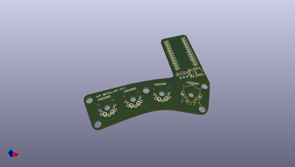
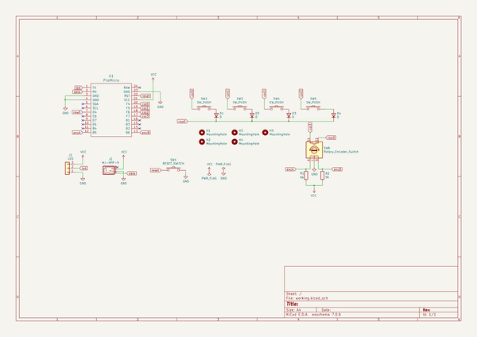

# OOMP Project  
## va4-keyboard  by gorbachev  
  
oomp key: oomp_projects_flat_gorbachev_va4_keyboard  
(snippet of original readme)  
  
- The DIY Keyboard `va4` (v0.4.x)  
  
`va4` the 4x2 key split keyboard.  
  
**`OEM Profile Keycaps` + `CherryMX Compatible Switch`** version: (`v0.3.0`)  
  
  
  
**`G20 Profile Keycaps` + `CherryMX Compatible Switch`** version: (`v0.2.0`)  
  
  
  
**`Kailh Choc(Low profile)` Key Switch** version: (`v0.2.0`)  
  
  
  
-- Features  
  
* 🕹 Support for `Rotary Encoder` in v0.4  
  
* ⌨️ Support `Cherry MX Compatible Switch` and `Kailh Low Profile Choc Switch`  
  
    
  
* 🖥️ Support `Pro Micro` compatible board  
  
    
  
* 🔑 Password writing space  
  
    
  
* 🥚 Columbus' egg included  
  
    
  
* 📜 Open Source License  
  
  full source readme at [readme_src.md](readme_src.md)  
  
source repo at: [https://github.com/gorbachev/va4-keyboard](https://github.com/gorbachev/va4-keyboard)  
## Board  
  
  
## Schematic  
  
  
  
[schematic pdf](working_schematic.pdf)  
## Images  
