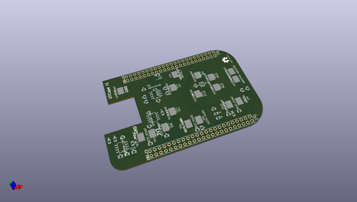

# OOMP Project  
## UTCape  by graycatlabs  
  
(snippet of original readme)  
  
- UTCape  
  
A BeagleBone Black cape to support unit tests in software libraries like PyBBIO   
and Bonsescript.   
  
The current concept would allow testing of GPIO, UART, SPI, I2C, ADC, eCAP, PWM,  
and eQEP software.  
  
  
  full source readme at [readme_src.md](readme_src.md)  
  
source repo at: [https://github.com/graycatlabs/UTCape](https://github.com/graycatlabs/UTCape)  
## Board  
  
  
## Schematic  
  
  
  
[schematic pdf](working_schematic.pdf)  
## Images  
